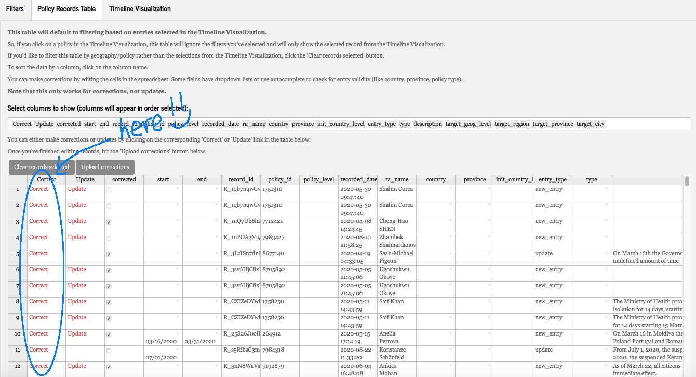
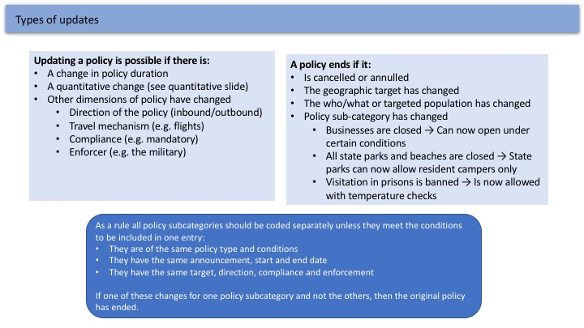
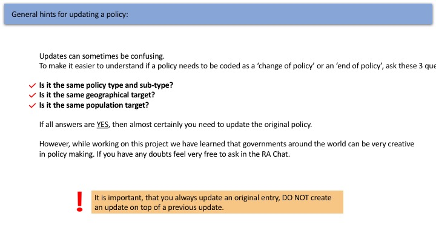
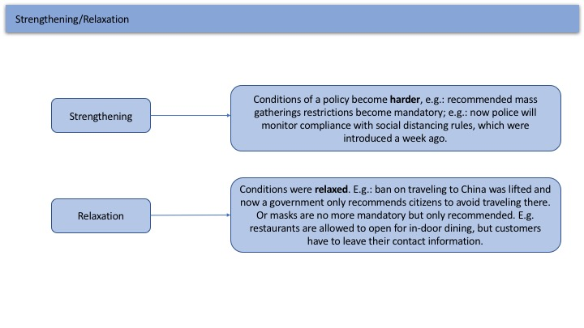
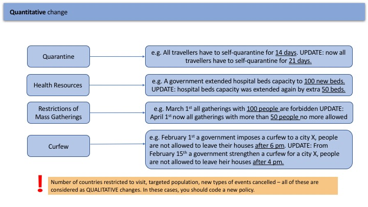
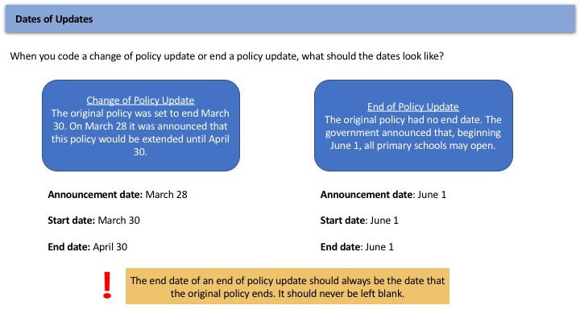

Updates and corrections can sometimes be confusing. 

* What does a quantiative change of policy update mean? 
* What can I update and what cant I update? 
* When should I correct something? 
* What policy type should I code this policy as? 

These are all questions we hope to answer in this coding guide. It is important to keep in mind...

* **Sometimes there is no right answer** for a policy and it may fit into more than one category. For example, testing students before they go to school could be under health testing or closure and regulation of schools, but we code it as closure and regulation of schools. 
* **What is important, is not being “right” but setting guidelines so that all entries are coded the same**. In this case, even though testing in schools could fit under health testing we need everyone to know that it should be coded as a closure and regulation of schools. We want two independent coders to see this policy and both code it correctly. This increases our intercoder reliability and makes our data very valuable for researchers.

**Please click around the guide so that we can all consistently code policies across different coders and different regions**. In this guide, you can also find answers to the questions raised above as well as 'good' and 'bad' examples for coding various policy types among a wealth of other information. 

As always, feel free to also ask questions in [#ra-chat!](https://corona-govt-response.slack.com/archives/C010V8MKHK2). If you want to suggest some more material that we can add to this coding guide, we will happily award you hogwarts points for it!

## How do I... {.tabset}

### Decide: correction or  update?

It depends on what the issue is!

* If the information you want to change in the policy was announced in the original source and you have just made a typo or miscoded something then you should correct the original entry.

* If you have found a new source that later announces a new end date, compliance or another change to the policy then it should be updated.

### Code a correction? 

You can code a correction in:

 

  
Through a Qualtrics Link

   + Go to the [Shiny App](https://kubinec.shinyapps.io/corona_validate/). Filter to find the record you want to correct and then click on the 'Policy Records Table'
    + Click on the 'Correct' link 
    
   {width=50%}
  + You will then be taken to the Qualtrics survey where you can make your corrections directly there.

 

  
Directly in the Shiny App

  
  + You can also make corrections for a limited number of variables directly in the Policy Records Table in the Shiny App
  + Please restrict the corrections you make in the Policy Records Table to the following:
    + description
    + demographic target variables
    + date variables
    + enforcer variables
    + compliance mechanism
  + For corrections involving the opening of institutions with conditions or the geographic target of a policy, please make these changes in Qualtrics as they involve display logics that are not replicable in the Shiny App

### Code an Update? {.tabset .tabset-fade .tabset-pills}

#### What kind of updates are there?
There are two types of updates: a 'change of policy' update and an 'end of policy' update. If a policy changes we should update it --- but which type of policy should you choose?  

...Still confused? 

#### What else should I know about 'Change of Policy' updates?

There are two kinds of 'Change of Policy' Updates: updates that are 'strengthening' or 'relaxing'. You are given the choice to select between the two in the survey, but how to choose the right one?

It is only possible to make an update a ‘Change of Policy’ Update for the 4 policy types below. These are so-called ‘quantiative changes’ (as opposed to qualitative changes) :

#### How do I code the 'dates' for an update?

### Code different policy types? {.tabset .tabset-fade .tabset-pills}

#### What is a policy sub-type? 
In our survey we have broad policy types, e.g. Restriction and Regulation of Businesses and Public Awareness Measures. 

Within some of these policies it is possible to further describe the policy you want to code. 

Visit [this page](https://docs.google.com/spreadsheets/d/10XiTrBSOJkJvCW0lYt2W6MJo3CCLANjvMjIG4RuOd6Q/edit?usp=sharing) to find out what all the possible policy sub types are!

#### Closure and Regulation of Schools {.tabset}

Closure and Regulation of schools category implies all policies, connected to all levels of schools and the higher education system. 

Typical examples are: 

* closure of schools
* reopening of schools
* online study. 
* Cancellation/postponement of exams, graduation ceremonies, school competitions etc.  

When reopened schools frequently have new rules of operation. Some typical examples:

* Restricted number of kids in classes; 
* Distance between school desks or between kids;
* Body temperature checks at schools;
* COVID-19 tests before attendance of schools;
* New schedule for classes, etc. 

*Only the need to wear masks at schools should be coded separately, under Social Distancing* text.

##### Good Examples

##### Bad Examples

#### External Border Restrictions {.tabset}

External Border Restrictions policies are targeted towards banning/restricting the movement of people across borders of a country/state or region.  Some typical examples: 

* Ban on traveling to a country A; 
* Citizens of a country A are no more allowed to enter country B;
* Medical workers can not travel abroad;
* Ban or restrictions on issuing working/travel visas;
* Extending visas to stop outbound travellers
* Health checks at the border;
* Special permits for travellers from outside a country/region
* Being tested for COVID-19 before entering the country

##### Good Examples

##### Bad Examples

#### blah
test
