```{r setup, include=FALSE}
knitr::opts_chunk$set(echo = TRUE,warning = FALSE)
```

<style>
body {
text-align: justify}
</style>

***
|
This document contains thorough instructions for project implementation for CoronaNet. Given the complexity of this project, we want to thoroughly document all of our procedures so that we can ensure quality control and produce as excellent a dataset as we can. 

Each section should be as precise as possible, mentioning what the goals we want to accomplish are (on what time scale), and list a series of steps that should be completed for each task to be complete. Please use screenshots whenever possible to make it abundantly clear what the person reading this document is supposed to do. The goal would be for it to be relatively easy to add people to any of the main areas of this document and have them participate.

|
|
|

## Useful Links{-}
** **

### Training Videos{-}


*   **[RA Training CoronaNet](https://nyu.zoom.us/rec/play/v8B8f--r_TI3HIXH5QSDA_cvW9XpJ_6s0CRMqPtYzU6xBngHMAGlYLVHMOFrjixNPdfSi0IE6gbKbHQ2?continueMode=true&_x_zm_rtaid=GA1uE4UPTNCAvxyXCOkx8Q.1591210535149.378a4abe9ece4f1a731c0b0c710927c9&_x_zm_rhtaid=261),** 14th May(1:46h) : This is the main training video which all RAs must watch before starting on the CoronaNet Research Project
*   **[Updating and ending policies](https://tum-conf.zoom.us/rec/play/vJF5fuGop243GdyQsQSDC_QqW426KaOshHMfqaBZnhrnViIBO1PzZ-QaZbPBtptgnr6hozgzRfrwne6q?startTime=1588513802000)** 14th May. Password: 7C&*60@= ( : This training video shows RAs how to enter an update and how to end a policy. The accompanying slides are pinned to the #ra-chat channel. Note that the video is somewhat dated in that it was not possible to enter in updates using the RShiny App and the video shows how to do a manual update which is no longer possible. However, the underlying guidelines of when to do a ‘change of policy’ or ‘end of policy’ as well as what counts as an update still holds. 
*   **[CoronaNet Background Video ](https://www.dropbox.com/s/61byca7367mfhr9/Zoom_CoronaNet_Process.mp4?dl=0)**: This video outlines the process of registering RAs, data collection, advantages of qualtrics, data validation, reliability, cleaning, difference between beta and final dataset (15:00h)
*   **[How to Use the Shiny App/How to Fill out the Up-To-Dateness Completeness Sheet:](https://www.dropbox.com/s/et6swhdzqy9u66m/Up-To-Dateness%20and%20Completeness%20Tutorial.mp4?dl=0)** This video outlines how to use the Shiny App and how to fill out the Up to Dateness and Completeness Sheet (see [Regional Update and Completeness Sheet](https://docs.google.com/spreadsheets/d/1gNvxWSrAdrM2aj7JyQKlAdQNdBkl7kDMOdJWSZBjvj0/edit?pli=1#gid=0) and/or [Country Update and Completeness Sheet](https://docs.google.com/spreadsheets/d/1J45Gme8WoxV2CaqrhiQa2wDXazQrw99wrAzF_Ew511U/edit#gid=508634612) for the relevant sheets )

### Weekly Meetings{-}


*   **[CoronaNet General RA Meeting](https://nyu.zoom.us/j/99864509982): **In the general RA meeting that we have every Wednesday at 4:30pm CET, the PIs share updates about the progress of the project. Recordings of older meetings can be found at the end of this section. 
*   **Regional/Country RA Meetings**: RAs should also have a regular weekly meeting with their regional or country manager. The relevant link for that meeting should be provided by the appropriate regional or country manager.


### Surveys{-}


*   **[Test Survey](https://tummgmt.eu.qualtrics.com/jfe/form/SV_0354jWNWJ4H9tKB?RID=MLRP_3foqmqo1KXqJesd&Q_CHL=email) : **This is the link to the test survey that each RA must pass with at least 70% accuracy in order to join the project. After passing the test, RAs should feel free to take the test survey as many times as they would like in order to learn more about how to use the main survey.
*   **Main Qualtrics Survey: **The main Qualtrics survey is the main tool by which RAs collect data on government policies for the CoronaNet project. Note that there is no general link for the main Qualtrics survey. Everyone has an individualized survey link that is emailed to you. 


### Correcting or Updating the Main Survey{-}

RAs can correct or update the main survey using either:

*   **[The Shiny App](https://kubinec.shinyapps.io/corona_validate/): **This app allows RAs to visualize policies. It further provides links to update or correct the survey for each unique record. It further allows RAs to directly correct a limited number of dimensions of a policy directly in the app. Please see the section of this manual on the Shiny App for more information on how to use it.
*   **[CoronaNet Record Lookup](https://docs.google.com/spreadsheets/d/183lWnJH7rSVkOTiuCXt9D7uCwS1SdJSOleXPpFkj2us/edit#gid=0 ): **This google sheet provides an overview of all records in the CoronaNet database and the corresponding links to update or correct each unique record.


### Information Resources{-} 


*   **[CoronaNet Data Codebook](https://docs.google.com/document/d/1zvNMpwj0onFvUZ_gLl4RRjqS-clbHv3TIX6EOHofsME/edit?usp=sharing): **This codebook explains what dimensions of a given policy different questions/variables in the main survey seek to capture. It previously also had information about data collection which has now been moved to this manual in the ‘Data Collection and Entry’ section.
*   **[#ra-chat](https://app.slack.com/client/T010PHG8J6A/C010V8MKHK2): **This Slack channel is the main place where RAs should post questions about how to code different policies
*   The FAQ tab in the **Shiny App**: The FAQ tab summarizes and organizes common questions asked in the #ra-chat channel


### Organizational Tools{-}


*   **[Validation sheet](https://docs.google.com/spreadsheets/d/1jzj02OIWQPNtV-sT82ZT7_qW5XJRpchbc9-xD3zI4rw/edit#gid=0): **RAs on the validation team should assign themselves a record to validate using this sheet
*   **[RA Allocation Sheet](https://docs.google.com/spreadsheets/d/1qxkKu7gOdt2I0JjgJmviD6EpKdJoP9gU1p5cjOqgONk/edit?usp=sharing):** Information on which RAs are allocated to which countries are available in this sheet
*   **[RA Allocation of sub-national states](https://docs.google.com/spreadsheets/d/1cesReaVkn0-w-0kGjgGHX7WHVZqtejbcQAw0SC7VRZ0/edit?usp=sharing )**: Information on which RAs are allocated to which subnational regions are available in this sheet
*   **[Regional Update and Completeness Sheet:](https://docs.google.com/spreadsheets/d/1gNvxWSrAdrM2aj7JyQKlAdQNdBkl7kDMOdJWSZBjvj0/edit?pli=1#gid=0 ) **Information on the up to dateness and completeness of records at the national level are available in this sheet
*   **[Country Update and Completeness Sheet ](https://docs.google.com/spreadsheets/d/1J45Gme8WoxV2CaqrhiQa2wDXazQrw99wrAzF_Ew511U/edit#gid=508634612)**Information on the up to dateness and completeness of records at the sub-national level are available in this sheet


### Other{-}

**[Instructions for Country Reports and Research Notes](https://docs.google.com/document/d/11sz8NnVmf5-XzfEpxjbfJzxoOXv1euCDngTXwNu7-UA/edit) : **Instructions on how RAs should write country reports or research notes are available at this link.


#### Recordings of Previous CoronaNet General RA Meetings{-} 

  * **[4 April 2020](https://nyu.zoom.us/rec/share/2uhcLYyg-nJOG7fI9VDNBoUwF6HcX6a8gSYZqPYImhltfNYDQ7i2QLjNim-URRN3)**
  
  * **[25 April 2020](https://nyu.zoom.us/rec/share/wtVKfrDcx2hIT53gy2zhRaInAcPmT6a8hiAZ-KALnUiNru4cJeM1eF83MEpPNBVT)**
  
  * **[6 May 2020](https://nyu.zoom.us/rec/share/5PJED-3B-EFOaavQz0Pif7A8ILviT6a80CEf_aZbxE9KKnrmgEPcg4sL-1Q__qFj)**

  * **[20 May 2020](https://nyu.zoom.us/rec/share/4v52c-nTyDJOeqPi2R-OArQ6J4_Uaaa8hCEWq_UPmUt7Jp-ax2nMhzw7C8NS6h_E)** 

  * **[3 June 2020](https://nyu.zoom.us/rec/share/7MNzJpHWynFLZIXf4mr-e6g8JoXhX6a8hnIW8qAKmE7cVne9yaIIQ5PxAmxv_to6)** 

  * **[10 June 2020](https://nyu.zoom.us/rec/share/6ZV6AZPd1EFLbK_n1UTtY74fM6LqX6a8gCNK8vAIxUj-Q7kfk0GqKFQsBh98-ff6)**

  * **[17 June 2020](https://nyu.zoom.us/rec/share/_etbA77w7WdJXM_x8BDvBOknJaXLaaa8gCYe8_QEzBogpRx-DJ9HArk3_iRmD7ut)**
  * **[24 June 2020](https://nyu.zoom.us/rec/share/ougvMZHLx3pLUs_o-m3dVrQuINrpaaa82nNI-PZYzhq7g0rnYO08YoTSrWRANOXl)**

  * **[1 July 2020](https://tum-conf.zoom.us/rec/share/18lRAKiu9XpIT6PiyWzEW6IuB6j5X6a8gSgZqKIPxU26LvKiZ4mNaTKbzMXLATsB)** (the week Luca takes over! Password: 1t@8%PjI)

  * **[8 July 2020](https://nyu.zoom.us/rec/share/pul5E7Os-E9LeoXItk_eRYM6OJXgeaa80ykaqKcMn0kh8QPyRQ5eHPO2Ug1RHbMc)**
  
  * **[15 July 2020](https://nyu.zoom.us/rec/share/wM9IL4PP11lLTKfh0mqEc6R_RIHhT6a80CdLqaBcn0fG9TEEeWGiycXzgjp2UTeK)**
 
  
|
|
|

## Data Collection and Entry{-}

** **

### What is data collection and entry?{-}

Data collection and entry forms the foundation on which the rest of the project is built. The ultimate goal of the project is to produce an accurate and complete record of all policies governments have taken in response to COVID-19. This entails 1) identifying relevant policies that governments have taken in response to COVID-19 2) documenting them in a standardized format.


### What should I do before starting with data collection and entry?{-}

Before entering in data, you should:


1. Watch the required general [training on Zoom](https://nyu.zoom.us/rec/share/9cdaCrL_qUFOYbfT5EDxe_I8D7q-eaa82iVNr_APzBuFcffq3OYSOR7NqOaeBScY) before starting to collect the data. 
2. Watch the required training on zoom on how to do updates to the data
3. Read through the Variable Definitions in the codebook and the corresponding examples provided below
4. Pass the CoronaNet Training survey with at least 70%
5. Look through the RA FAQs in the **Shiny App** for commonly asked questions

The value of this data is only as good as its quality so please be sure to take your time with documenting these policies, and pose your questions to the Slack Channel or the PIs if in doubt! 
 
**If you are the first person to code for a particular country or subnational region:**
Please start as far back to December 31, 2019 (when China first reported the COVID-19 outbreak in Wuhan to the WHO) and start documenting policies forward in time.

**If you are not the first person to code for a particular country or subnational region:**
Please first review what policies the previous coder has coded for your country or subnational region; the **Shiny App** provides a great tool with which to get the lay of the land. In doing so, please check for the up-to-dateness and completeness of the policies entered. By up-to-dateness, we mean, assess when the last time a particular policy type for your region has been coded. By completeness, we mean, assess whether all policies types have been documented by checking against available primary sources (see more on this below). Where you identify mistakes, please make the appropriate corrections. Ideally, you would only begin coding new policies after this has been done.


### What counts as a ‘policy’?{-}

These policies can be thought as being in one of two categories:


1. **A new policy**
2. **An updated policy**

A **new policy** is a policy in a category that the government has not addressed before, such as the imposition of a quarantine on the country. An **updated **policy is a policy change in which the details of the policy change, **but not whom the policy is targeted at**. For example, if Germany announces a quarantine for one province, and then later extends the quarantine for two weeks, that would count as an **update**. But if Germany announces a quarantine covering the whole country, that would count as a **new policy**. The same logic goes for travel bans -- making travel bans cover more countries/areas counts as new policies. Changing the way existing travel bans are enforced would be an **update**. For more information, please reference the codebook below. Please watch the required training on zoom on how to do updates to the data for more information and refer to the accompanying slides.

**If in doubt, ask on the #ra-chat Slack channel!**

In the Qualtrics survey, you must select either new or updated. To update a policy, find the previous record either:


1. The Record Look up sheet or
2. The Shiny Web Application

Moving forward, we would want you to use the web application as it contains the same data as the Record Lookup sheet, but in a format that is easier to visualize. Also, you can do some corrections in the app itself.

To update, click on the ‘update’ link that is on the left-hand side of the table/google sheet. See pictures:

<center>

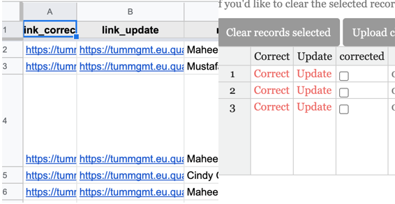

</center>


#### How do I document a ‘policy’?{-}

The below gives a textual overview of how to document a policy. Please refer to the required general [training on Zoom](https://nyu.zoom.us/rec/share/9cdaCrL_qUFOYbfT5EDxe_I8D7q-eaa82iVNr_APzBuFcffq3OYSOR7NqOaeBScY) for more information.

<span style="text-decoration:underline;">Use the following checklist:</span>

  1. For each country, check the data sources, in the order given below in the "Data Sources" section, for relevant information on government policy toward combating the coronavirus.


  2. Enter the relevant information into your country specific dataset. It should always be possible to answer the following request/questions for a particular policy:
  
  
      *   What type of entry is this? (e.g. new, correction, update)
      *   Description of the government policy
      *   What is the policy category? (e.g. travel ban) 
      *   From what level of government does this policy originate from?
      *   What kind of enforcement does this policy have (if any)?
      *   Which organizations or entities are in charge of enforcing a policy?
      *   When was the policy announced?
      *   What information sources did you use to identify this policy?
      
      
      Some, but not all policies,[^1] will also require you to identify:
  
      *   Which geographical entity is the target of this policy?
      *   What or whom is the policy targeted toward?
      *   Is this policy inbound, outbound or both?
      *   What kind of transportation is this policy targeted toward?

      When it is not possible to collect this information, please note the reason for the difficulty  at the end of the survey. 
    
      Please document each source by answering the according survey question. Currently, the dataset allows you to code up to 10 sources. Note also that it is possible that you will need more than one source to collect all the information for each event.


  3. Save a .pdf for each data source that you use. As the file name, use the following format: [Date Collected]_[Title of article].pdf where the [Date Collected] should follow the format MM-DD-YYYY


  4. You can upload the file within the Qualtrics survey (be sure to choose the correct country): 


### How do I find a policy?{-} 

The rest of this document tells you how to go about finding policies. Of course you can just use your own knowledge and Google, but we have some great resources we’ve identified below you should use to get started.


1. **We now have a source of news articles possibly related to the coronavirus by country compiled by the data science company Starsift. **Please see [this link](https://docs.google.com/spreadsheets/d/1EW-Vsue2fQ7k41gC31hWjIUr290VPDO-0w-Ig_Wh71E/edit?ts=5e865e7d#gid=0) for a list of news articles (articles that are more likely to contain a policy are marked in the “policy” column, though all of the articles could contain some information.
2. **Use the ACAPS COVID-19: Government Measures Dataset as a foundation**

    <span style="text-decoration:underline;">What is this?</span>


    The first resource to check for government policies against coronavirus is this easy to use online dataset, ACAPS COVID-19, which has collected data on government to COVID-19 on the country level. While their data provides an excellent foundation for our data collection effort, we seek to build more fine-grained data in terms of, among other things, (1) what types of policies were implemented (2) who the policies were targeted to and (3) whether there were updates to existing policies, than the ACAPS COVID-19 dataset does. ACAPS is a non-profit humanitarian organization which regularly works with international aid partners to provide analysis on humanitarian crises. 


    <span style="text-decoration:underline;">How to access this source:</span>


    You can download the ACAPS COVID-19 dataset [here](https://data.humdata.org/dataset/acaps-covid19-government-measures-dataset).


    <span style="text-decoration:underline;">How to use this source for your country:</span>


    The dataset contains a list of government restrictions with helpful URL links. We may need more info than they have on their to complete our Qualtrics survey, but please work through all their data and links before searching elsewhere.

    Once you’ve worked through that dataset, you should do some searching on your own. Of course Google/Google News is a good asset, but there are other available sources:


3. **Check the U.S. Embassy website for your country.**

    <span style="text-decoration:underline;">What is this?</span>


         

    Most U.S. Embassies’ have a designated webpage for disseminatingCOVD-19 


    Information for a particular country. For example, the U.S. Embassy & Consulates in Germany’s web page for this information can be found [here](https://de.usembassy.gov/covid-19-information/).

    <span style="text-decoration:underline;">How to access this source for your country:</span>


    You should be able to find this page for your website by Googling “U.S. Embassy [Your Country Name] COVID-19 Information”.

    <span style="text-decoration:underline;">How to use this source in the dataset:</span>


    <span style="text-decoration:underline;"> </span>

    The U.S. Embassy’s designated webpage on the coronavirus in a particular country will often list information on, for example, entry and exit requirements or quarantine information. Often the U.S. Embassy will also link to the primary home government source for this information. 


    When links to the primary source of information are made available:
    

      1. Click on the link
      2. Corroborate the information from the primary source
      3. Use this link as the primary source of information when using the survey instrument. entering the data into the database.  
      
        

    Use the U.S. Embassy page as the primary source if:
      -   There is no link or;
      -   The information on the linked page is in a language you do not speak.


    Please especially make sure to save a .pdf of the relevant page for your country for the day you collect the information if  using the U.S. Embassy page as a source because it may update relatively frequently with new information.


   


4. **Check Wikipedia for your country’s response to the corona pandemic**


    <span style="text-decoration:underline;">What is this?</span>


    For many countries, there is a designated Wikipedia page for how a country has dealt with the coronavirus pandemic. For example, the “2020 coronavirus pandemic in the Dominican Republic” can be found [here](https://en.wikipedia.org/wiki/2020_coronavirus_pandemic_in_the_Dominican_Republic.).


    <span style="text-decoration:underline;">How to access this source for your country:</span>


    You should be able to find this page for your website by Googling “Wikipedia [Your Country Name] corona”.


    <span style="text-decoration:underline;">How to use this source in the dataset:</span>


    You should treat the Wiki as a platform that aggregates information sources, not as an information source itself. That is, you should **NOT** cite the Wikipedia page as your news source. When entering information from Wikipedia into the dataset, please do the following:


    1.  For every claim made on Wikipedia, visit the link of cited source in the footnotes.
    2. Corroborate the information stated on Wikipedia in the information source
    3. Add additional relevant information from the primary source to the dataset if you find it.
    4. If there is no source given for a claim made on Wikipedia or if you cannot corroborate the source, Google it --- if you still do not find a corroborating source, do not enter the information into the dataset.

   


5. **Check Government websites for your country**
  
  
    <span style="text-decoration:underline;">What is this?</span>

    Different countries will have different government ministries issuing information in response to the crisis. In the course of gathering information on your country from going through the relevant U.S. Embassy and Wikipedia web pages, you may be able to identify the most relevant government ministries for your particular country. For example, the [Taiwan CDC](https://www.cdc.gov.tw/En) has up to date information on government policy toward the coronavirus.

 
    <span style="text-decoration:underline;">How to access this source for your country:</span>

    If you have identified the relevant government ministries in charge of responding to the corona crisis for your country, Google: “[relevant ministry or department] corona”


    If, however, you have been unable to identify a relevant government body from the relevant U.S. Embassy and Wikipedia web pages, then:


        

      1. Identify/Google the executive body for your country and your country’s government bodies in charge of health, foreign affairs, or internal affairs and
      2. Google: “[relevant ministry or department] corona”


    <span style="text-decoration:underline;">How to use this source in the dataset:</span>


         

    We consider information that comes directly from the government as a primary 


    source. Identify any relevant information from the government websites and enter them into the dataset.


    Please especially make sure to save a .pdf of the relevant page for your country if using the a government page as a source because it may update relatively frequently with new information.


         

6. **Check Newspaper coverage on the coronavirus in your country**

 

    <span style="text-decoration:underline;">What is this?</span>

 


    LexisNexis, Factiva are platforms which aggregate, among other things, newspaper articles around the world.

           

    <span style="text-decoration:underline;">How to access this source for your country:</span>

    <span style="text-decoration:underline;"> </span>

    Use your home institution to access these datasets.

 

    For NYU students, you can do so here:

 


      * [Factiva](https://persistent.library.nyu.edu/arch/NYU00954) 
      
      * [Nexis Uni](https://persistent.library.nyu.edu/arch/NYU02479)

 

    For the Technical University of Munich, you can do so here:

 


      * [Factiva](https://www.ub.tum.de/en/datenbanken/details/102480)
      
      * [LexisNexis](https://www.ub.tum.de/datenbanken/details/1670)


         

    <span style="text-decoration:underline;">How to use this source in the dataset:</span>

 


    You can search these articles for different search terms such as “quarantine” and “travel ban” to see what pops up and when. Please limit your search to December 31, 2019 (when China first reported the coronavirus to the WHO) to the present.

 


    We consider information that comes from newspaper articles as a primary source. Identify any relevant information from the newspaper article and enter them into the dataset. However, if you have doubts or qualms about the rigor of a particular publication outlet, please do not hesitate to raise your concern with us.
    


7. **Other resources**

    We will update this section accordingly as more information becomes available. For now, some other resources you might consider include:


    *   Check Facebook and Twitter accounts for political leaders in the country (or for health ministries).
    *   This is a crowd-sourced list of government actions against the coronavirus by the Open Government Partnership (OGP). Note please be sure to vet the sources here carefully as the OGP themselves do not control for the quality of the entries made [here](https://docs.google.com/spreadsheets/d/1UOdONQoD5wiS2MZW8PEwnEyklDTUZqWKlys3304WKoY/edit#gid=921375421 ).
    *   [This website](https://coronavirustechhandbook.com/data) is a crowd-sourced compendium of information about the coronavirus. For now these appear to deal largely with the health outcomes associated with coronavirus but may be useful insofar as includes many links to in-country websites.


### What to do if I need to delete an entry?{-} 

Please post the entry that you need to be deleted in the #orphaned-records channel and provide a reason for why the entry needs to be deleted.

With regards to incomplete records, please note:

  * We DO include in the dataset records for which the RA filled everything out except they didn’t hit the final submit button; all other records are not included
  * If, however, you are seeing a record in the record sheet that looks incomplete, please let us know (those are supposed to be filtered out before the record sheet is populated). Note however, if the record is is a correction, it may look incomplete because a correction may only correct one part of the original record

|
|
|

## Data Cleaning{-}

** **

### Why are we doing data cleaning?{-}

In parallel to the regular validation process, we need reliable people who can take the responsibility of cleaning our main dataset. As of today, we have over 12,000 policies in the dataset with great granularity. Unsurprisingly, we are sure that some of them have errors and typos. While it will be impossible to correct all of them, we need to make an effort to minimize errors. To do this, we have designed the following cleaning protocol that those involved with data cleaning should follow.


### What should be ‘cleaned’?{-}

The goal of data cleaning is to clean _clear errors and or typos_ as opposed to conceptual errors. 

Clear errors/typos are of the following kind: e.g. the policy is targeted toward ' China, Iran, Singapore, South Korea, or Italy’ but the original coder left out ‘Iran’.

Conceptual errors have more to do with how certain policy types should be coded to match our coding guidance: e.g. is this policy about social distancing or a quarantine?

There will be a gray zone between clear errors and conceptual errors. Please do feel very very free to ask us as many questions as you have about what should be ‘cleaned’ and what shouldn’t be and how to clean it, but for the most part, if you’re finding it difficult to judge if something is an ‘error’ or not,  then leave it alone.

Please pay special attention to the qualitative description, as it should contain:


*   The name of the country from which a policy originates
*   The date the policy is supposed to take effect
*   Information about the 'type' of policy (see buttons below)
*   If applicable, the country or region that a policy is targeted towards
*   If applicable, the type of people or resources a policy is targeted towards
*   If applicable, when a policy is slated to end

A proper description should contain all the above points where applicable.


### How do I get started with data cleaning?{-}

The process requires you to follow these basic instructions:


#### Get Organized:{-}


1. Get an account in Trello and make sure that one of the PIs gives you access to edit the project "Data cleaning (validation team)"  
2. Make sure one of the PIs invites you to the #data_cleaning_ Slack channel 

<center>


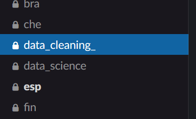{width=30%}


</center>


#### Assign yourself a Cleaning Task{-}

In this project, you will see that we have divided the dataset in different chunks. This allows the cleaning process to be divided into several people.


3. Assign one of these to yourself by editing "change members", "Change Due date" and "Move" to the cleaning column (with the date that you expect to be done with this cleaning).

<center>


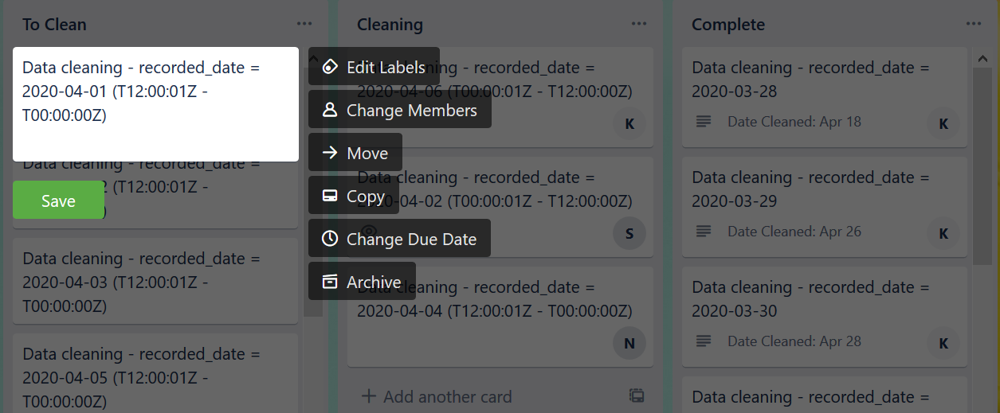{width=70%}


</center>


#### Clean the Data{-}


4. Go to the CoronaNet website and [download](https://coronanet-project.org/download) the latest version of our core dataset (CoronaNet Database BETA Version 1.0 (core)). 

<center>


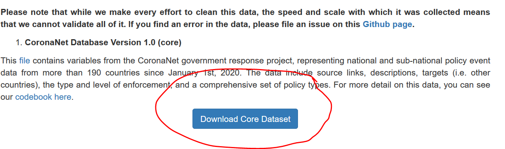{width=70%}


</center>

5. In the main dataset, for the observations that you have been assigned to, evaluate whether the information entered across all columns adequately captures the information in the column "event_description."


6. To check the event description, please use the R-Studio code posted in the #data_cleaning_ Slack Channel. For instructions on how to use the code, please watch this [video](https://corona-govt-response.slack.com/archives/G011RS4L03Y/p1591792230012400 ).
7. If you consider that the observation requires no changes, move to the next observation.
8. If you think that the observation requires being changed, use the RShiny App to correct the entry (Note that the released dataset has one row per target rather than one row per entry, so you need to take that into account when adding a correction). 

    The instructions on how to use the R-Shiny app are also present on the video above. 

9. **NOTE: You should not be spending more than a couple of minutes per record maximum, if you’re spending more time, than either ask for guidance in the #data_cleaning_ channel or move on**


#### Dealing with Systematic errors{-}


10. If, in the process of cleaning, you notice that the original coder is making a systematic error, please
    1. Notify the #data_cleaning channel that this is has happened
    2. After consulting with a PI, please contact the original coder and let them know that they are making this systematic error and ask them if they could please code back, and make the appropriate corrections to their entries
    3. If the original coder is no longer involved in the project or otherwise unresponsive, please let the #data_cleaning_ channel know and we will assign a new RA to address this systematic error 


#### Finalize a Cleaning Task{-}


11. Once you have finalized cleaning all the observations that you have been assigned to, please update the “due date” in Trello and move the card to the column on the right to “complete” section.

<center>


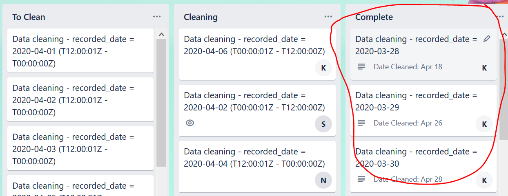{width=70%}


</center>


### How do I become a data cleaner?{-}

Data cleaners must possess a deep knowledge of the ins and outs of the survey and data collection process to maintain the integrity of the data cleaning process. Data cleaners must also possess working knowledge of a programming language (preferably R) in order to participate in the data cleaning process. To date, a select few research assistants have been invited to be data cleaners only after they have spent substantial time with data collection and validation.


### Examples{-}

For example, see policy_id = 6298255:

event_description = 'Albania began health checks at the airport for passengers coming from China, Iran, Singapore, South Korea, or Italy on February 25th'.

4 rows:

target_country = China (row1)

target_country = Italy  (row2) 

target_country = Singapore (row3) 

target_country = South Korea (row4) 

Our coder forgot to select "Iran" in this entry. Sort the dataset to make sure that Iran has not been added later on (e.g., order the data by "init_country" and "target_country" and search for "Albania" and "Iran"). Once you certify that Iran is missing, go to the main survey in Qualtrics and add a Correction for this record_id where you will be able to correct the target_country so that you select China, Italy, Singapore, South Korea AND Iran. All else equal. Remember to sort the data again by "record_date" so that you ONLY change the observations that have been assigned to you)

Example 2: 

policy_ID  5808477

Event_description: “Nation steps up to COVID-19 Alert Level 2”

This policy is coded under “Declaration of Emergency”, but the description is not precise enough (there is no country name, and no dates) to understand if this policy was coded correctly. In this case we need to refer to the source, check the entry according to the information in the source, then correct the description and other variables if needed. 

|
|
|

## Data Validation{-}

** **

### Why do we validate data?{-}

Data validation is required to ensure our dataset is reliable and accurate. At the moment we have over 250 hundred hard working research assistants that are entering more than 17,000 policies, updates and corrections. With so many minds, there is bound to be a difference of opinion and skill on how policies should be coded. This difference gives rise to conceptual errors and policies that have been entered that differ to our coding guidelines. For example, is a policy about quarantining or lockdown? Should a policy be entered as one, or broken down into smaller policies? Ideally, we should have high intercoder reliability, which means that two independent people will code the same source in the same way, but with a complex survey this is increasingly difficult. To increase intercoder reliability, we have designed a validation process.


### How do we validate data?{-}

Validation is split into two main stages; recoding and reconciliation. Recoding is carried out by experienced coders, from a source chosen out of the randomly selected validation dataset. Reconciliation is done by the validation PIs, who take the original policy and the recoded entries and try to find a match, determining if two independent coders, who had the same source, found the same policy and coded it in the same way.


### How do I join the validation team?{-}


1. Send an email to Allison ([ahartnet@usc.edu](mailto:ahartnet@usc.edu)) or Joan ([joan.barcelo@nyu.edu](mailto:joan.barcelo@nyu.edu)) to signal your interest in becoming a validator.
2. We will then send you a link to a quick test survey that helps us check your coding level. We do this to ensure that everyone who joins the team has a comparable level of coding skills. The score threshold for being added to the validation team is 70% accuracy. 


#### Getting started with validation{-}


1. Once you pass the test, Joan or Allison will add you to the ra-validation slack channel.
2.  Pinned to the slack channel is a Google Sheet listing all observations to be validated (also known as the validation dataset) and the link to the validation survey. Click on it and follow the instructions below.


#### Assigning an observation{-}


1.  Look for an observation in the Google Sheet validation dataset that is not assigned to anyone else.

<center>

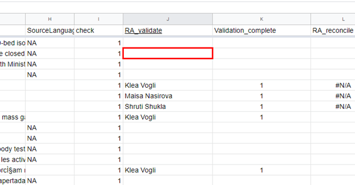{width=50%} 

</center>

2.  Click on the source to see the country/language.

<center>

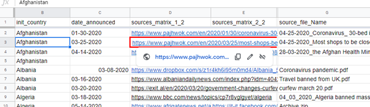{width=50%} 

</center>

3.  If you have the skills to code that observation (and you did not code that observation in the main dataset), then put your name on the RA_validate column in the Google Sheet.


4.	After assigning an observation to yourself, click the validation survey link,  select “Validation” and insert the corresponding “record_id,” which you can find in the spreadsheet. Identify yourself using the dropdown menu. If your name is not in the list, please send an email to [ahartnet@usc.edu](mailto:ahartnet@usc.edu) or  [joan.barcelo@nyu.edu](mailto:joan.barcelo@nyu.edu) and they will add you.


5.  Complete the survey for as many entries as you think it is necessary to have a complete picture of the policies announced in that country on that date from that source - in case of doubt, too many is better than too few.


6.  Once done, put a 1 on the column "Validation_complete".


    **Note: If the link to a source does not work, is missing, or links to an updating source, please message the PIs in the ra-validation slack channel to ask for the original PDF. **


### Second Round of Validation: “Checking”{-}

Every entry in the validation set will be validated twice. The second round of validation - termed checking for clarity - will help us determine the most appropriate coding for each policy. The procedure for checking is _nearly _identical to the first round of validation described above. Two important things to note:


1. You should **<span style="text-decoration:underline;">not</span>** check an observation that you coded in the original dataset.
2. You should **<span style="text-decoration:underline;">not</span>** check an observation that you validated in the first round of validation.

It is important that each round (original entry, validation, and checking) be done by three different individuals. This ensures that our original coding, validation, and checking processes are independent of each other and makes the quality of our data more reliable (statistically speaking)! What follows is a description of how to get involved in checking the data.


#### Getting started with checking{-}


1. You should email Allison or Joan with your intention to join the validation/checking team and pass the same coding survey test described in the validation section with a score of 70% or higher.
2. Once you are added to the ra-validation Slack channel, open the validation spreadsheet and look for an observation that is blank or NA in the column "RA_checker"
3. Click on the source/s to see country/language
4. If you have the skills to code that observation (and you did not code that observation for the main dataset and for the validation dataset), then put your name on the RA_checker column (you are assigning this observation to you)
5. After assigning an observation to you, then click on the survey link and complete the survey for as many entries as you think it is necessary to have a complete picture of the policies announced in that country on that date from that source---in case of doubt, too many is better than too few
6. Please, find your name in the list of contributors within the Survey (if your name is not in the list, send an email to [ahartnet@usc.edu](mailto:ahartnet@usc.edu) or [joan.barcelo@nyu.edu](mailto:joan.barcelo@nyu.edu))
7. Select "Checker Entry" from the multiple choice options and enter the record ID that you are checking.
8.  Once done, put a 1 on the column "checker_complete"


## Policy Completeness Check{-}

** **

This section contains coding instructions for policy-based completeness checkers. Before reading this, you should be familiar with the following resources: 


*   [CoronaNet Data Collection Guidelines and Codebook](https://docs.google.com/document/d/1zvNMpwj0onFvUZ_gLl4RRjqS-clbHv3TIX6EOHofsME/edit#heading=h.h8ru4k1sblui)
*   CoronaNet Training Videos:
    *   [https://nyu.zoom.us/rec/share/1_MyF6re50NLHYHqzljUQJUPNKvUT6a81nQY_PdYzU2QdKqLzG2K_QS3k8t8nFDB](https://nyu.zoom.us/rec/share/1_MyF6re50NLHYHqzljUQJUPNKvUT6a81nQY_PdYzU2QdKqLzG2K_QS3k8t8nFDB)
    *   [https://tum-conf.zoom.us/rec/play/vJF5fuGop243GdyQsQSDC_QqW426KaOshHMfqaBZnhrnViIBO1PzZ-QaZbPBtptgnr6hozgzRfrwne6q?startTime=1588513802000](https://tum-conf.zoom.us/rec/play/vJF5fuGop243GdyQsQSDC_QqW426KaOshHMfqaBZnhrnViIBO1PzZ-QaZbPBtptgnr6hozgzRfrwne6q?startTime=1588513802000) (Password: 7C&*60@=)


### Why is a completeness check necessary?{-}

The primary objective of a policy-based completeness checker is to evaluate the completeness of our dataset on some policies across several countries. 

Ever since we began this project, hundreds of research assistants have helped us in collecting policy information. While everyone has put a huge effort in systematically collecting all policies for all countries, we are aware that some policies might have gone undetected by our talented RAs. 

To ensure the completeness of our dataset, we request policy-based completeness checkers to compare our dataset with other datasets and check whether their information fully matches with our released dataset. We compare our dataset with the following dataset: [WHO PHSM Dataset](https://www.who.int/emergencies/diseases/novel-coronavirus-2019/phsm) consists of multiple other datasets and gives a great opportunity for a systematic comparison. 

As you will see, policy types are coarser and the country coverage is more limited in this dataset compared to our dataset. Therefore, we provide an overview of the different policy categories and how they can be assigned to the CoronaNet policy categories. This is helpful for the identification of policies that are compared. 


### Data collection methodology{-}


1. Access the [CoronaNet Policy Completeness Check](https://docs.google.com/spreadsheets/d/1jNeDVVE_faOVRLfW884nfTcMRkHM9qhYwtcnG2VpZnk/edit#gid=142648945) sheet and identify the policy category sheet you have been assigned to (e.g. Curfew). 
2. Find a region that has not been previously completed and add your name in the column “policy checker” for the subset of countries in your region. (Before adding yourself as a policy checker, make sure you have time to complete your task within a 24-h window). 
3. Make sure to get access to all datasets including CoronaNet (via RShiny App).
4. The idea is now to systematically compare the recorded policies of the other datasets with CoronaNet. Start with getting access to the respective dataset and getting familiar with the policies you are responsible for. (In the same file, you can see which policy categories of the other datasets belong to the your CoronaNet policy category you have been assigned to. Try to identify the WHO measures first. If they are not classified look at the class or sub-class of this policy.)
5. Check for the present country each listed policy within the category if it is included in your assigned policy category in CoronaNet. Therefore, search the country/policy information in CoronaNet via the RShiny App. 
6. Compare the information from the dataset under investigation with the information that appears in our dataset. Do this for all countries within your region or subset of countries that you indicated in the spreadsheet.
7. At least, evaluate the following aspects:
    1. Policy EXISTS in our dataset \
(e.g., if Canada closed schools, our dataset has information about closure of schools in Canada)
    2. Policy BEGINS at the same time in our dataset as in the reliable source
    3. Policy ENDS at the same time in our dataset as in the reliable source
    4. Policy CONTENT in our dataset adequately captures the policy information in our reliable source (e.g., target country/region, enforcement).
8. Once you are done with one policy-country, add “Yes” in the column “Completed” of the spreadsheet. If the country is missing from your reliable source, then add “NA” in the column “Completed.”


|
|
|


## Data Science Team{-}

** **

The data science team exists to manage the export and cleaning of Qualtrics survey data, and also to visualize and analyze the data. This team is led by Tim Model (Chief Data Scientist) and Clara Wang (Chief Data Engineer). The members of this team may have some data entry responsibilities but their primary goal is to ensure that our data pipeline is as smooth as possible, and also to employ data-analytic tools to check the data and extract insights.

Regular tasks assigned to the team include:


1. Daily exports of the Qualtrics data to our Github site, including cleaning the data, uploading for the RA record sheet/RShiny Data Validation App.
2. Retrieving changed records from the RShiny Data Validation App and merging into the released data.
3. Maintenance of the RShiny Data Validation App.
4. Help with adjusting the Qualtrics JavaScript backend.
5. Extract insights from the data through analysis and visualization.
6. Monitoring the #orphaned-records channel and adding deleted records to removal lists (and also identify any record issues outstanding).

The data science team currently consists of five groups:


1. Qualtrics: developing, managing, and maintaining the Qualtrics survey
2. Data Pipeline: data cleaning and wrangling, as well as releasing data to record lookup, AWS, and public Github repository
3. Shiny App: developing, managing, and maintaining the Shiny app used for data validation by RAs
4. Issue Triage and QC: identifying source of errors reported in Slack and elsewhere, including bad record IDs 
5. Data Visualization: developing visualizations for public-facing presentations of our data

If you are interested in joining the Data Science team, please message Tim Model or Clara Wang on Slack. 

|
|
|


## Qualtrics{-}

** **

Once an RA is onboarded, they will receive a link to the Qualtrics survey they should use to enter new records.

 

RA’s should select their name from the drop-down list (Hint: typing your name once the drop-down list is open makes it easier to find yourself in the list).

 

The **[CoronaNet Data Codebook](https://docs.google.com/document/d/1zvNMpwj0onFvUZ_gLl4RRjqS-clbHv3TIX6EOHofsME/edit?usp=sharing)** can be used to help fill out the Qualtrics survey.

 

The penultimate page of the Qualtrics survey is a review of all the information about the policy that has been entered, RA’s should scroll down and read this page before finally clicking on the ‘advance arrow’ to ensure the entry gets submitted to the dataset.

**How to retrieve a PDF Source?**

If you are working on validating an entry, you can request a PDF source by posting in the #ra-validation channel and someone with access to the survey will retrieve it for you.

Note that only those with permission to view/edit the Qualtrics survey will be able to retrieve a PDF Source. You will only be granted access if you are actively working on editing the Qualtrics survey or actively working on the raw Qualtrics output. Validators should not request to view the raw survey, as this will compromise the blind validation process. 

If you do have permission to view/edit the survey, you can retrieve a source by following this procedure:

Click on the dataset > Data & Analysis > Add Filter > Embedded data, record ID > Once you have the record you want, click Export & Import > Export > User Submitted Files. This will produce a .zip file of the desired source pdf(s) for that record ID.

|
|
|


## Slack{-} 

** **

### What is Slack?{-}

Slack is a collaboration software tool that enables users to share messages, tools, and files with their fellow team members.

 

It helps increase productivity amongst large, remote teams and saves everybody from getting lost in endless email chains.


### Key Functionalities{-}

 

_<span style="text-decoration:underline;">Channels</span>_

Channels are where the work happens!

<center>

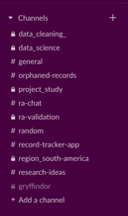
</center>
 

Each different part of the project has its own dedicated channel, where all the people involved in that part can easily communicate.

 

All the messages shared in these channels are searchable, so you will never lose out on information.

|       


_<span style="text-decoration:underline;">Threads</span>_

If somebody posts a message in a channel that you want to add to, start a thread specific to the original message.

|       
<center>

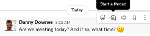

</center>

_<span style="text-decoration:underline;">Direct Messages</span>_

Perhaps you need to contact somebody within the project personally, but there is no need for a specific channel, utilise the direct message function instead.

|       
<center>

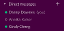

</center>

_<span style="text-decoration:underline;">Notifications / Mute Channel</span>_

Maybe it’s the weekend or you’re taking a break; pause all notifications here!


You can also customize notification settings or mute specific channels by clicking on the ‘Details’ tab of the channel.

|       
<center>

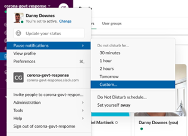

</center>
 

_<span style="text-decoration:underline;">Pinned Items</span>_

Important/useful messages in a channel may be ‘pinned’.

 

‘Pinned’ items can be viewed here!

|     
<center>

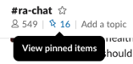
</center>


_<span style="text-decoration:underline;">“Online” / “Away”</span>_

Let your colleagues know whether you are available or not by changing your appearance between ‘online’ and ‘away’.

|

<center>

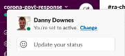
</center>

### Slack 'Office Hours'{-}

We have Slack ‘Office Hours’ in the  #ra-chat Slack channel from 8am CEST to 4pm CEST every day to answer your questions and provide feedback (while we may also be on at other times, we are making a commitment to being there during those times in particular). Please feel free to post to the channel in off-hours as well! We will get to your questions and comments as soon as we can.  

We  have some great RAs who have been working with us on this project for a long time who will be stepping in to help out with the #ra-chat questions, they are:

|   **Monday:** @Natalia Filkina-Spreizer

|   **Tuesday:** @Saif Khan

|   **Wednesday:** @Sarah Edmonds

|   **Thursday:** @Danny Downes

|   **Friday:** @Annika Kaiser

|   **Saturday/Sunday:** @Jack Kubinec

|
|

Note that a PI will always be monitoring these exchanges and a PI might step in if there is a tricky question, but you’ll be in very competent hands with the team above!


### CoronaNet Workspace{-}

All the information you need regarding the CoronaNet project can be found in our Slack workspace. In the rare circumstance you can’t find what you’re looking for, there will be somebody on-hand in Slack to help you answer your question.

 

Queries regarding policy coding, data validation, data cleaning, existing records, using the CoronaNet app, Hogwarts houses, Zoom team meetings, even birthday wishes for your CoronaNet colleagues, can all be found in Slack. It is the beating heart of CoronaNet!

 

Slack workspaces have subsets of different _channels_, the more aspects of the project you are involved in, the more _channels _you will be invited to join.

 

To help you navigate your way through the different _channels_, below you will find a brief summary of each one.

**# general**

Here you will find CoronaNet-wide announcements and updates, links to useful documents and general information about the project

** **

**[#ra-chat](https://app.slack.com/client/T010PHG8J6A/C010V8MKHK2):**

This is perhaps the most vital channel for newcomers to the project. It’s the channel where you should direct any questions you have when you are coding policy. Please don’t hesitate to ask any questions you may have, there is a group of experienced Research Assistants who are responsible for monitoring this channel daily to ensure you get a quick response.

 

**Check the “pinned items”** for some useful information for all RA’s. You can also utilise the FAQ tab in the Shiny App, which is updated based on the questions you ask in this channel. 


You can see the pinned items in the top left corner of #ra-chat

<center>

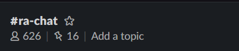{width=30%}

</center>

Example of a pinned post on #ra-chat

<center>

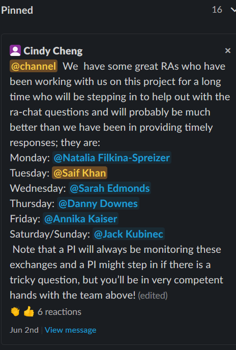{width=20%}
</center>
**# random**

With such a global team, spread across multiple time-zones, it’s impossible for us all to gather around the water cooler for a short conversation. Utilise this channel as a substitute! Also, a good place to wish people a happy birthday!

** **

**# record-tracker-app**

Direct any question you have about the CoronaNet record online app here.

** **

**# orphaned-records**

Use this channel to talk about any records you are having trouble locating (or otherwise need help with).

** **

**# research-ideas**

An open forum where you can share any research ideas you may have as you are entering data. Have you noticed anything peculiar / interesting / innovative about certain Countries / Regions approach to policy making? This is the channel to share those thoughts in. 

** **

**# Country / Region **

Once you are assigned a Country to work on, you will be invited to the corresponding channel. These channels are a platform for you to coordinate with the other RA’s working on the same Country / Region as you and provide an easy way for you to contact your Country/Regional Manager regarding any specific questions you have.

** **

**# Gryffindor / # Hufflepuff / # Ravenclaw / # Slytherin**

Once you are registered as a member of CoronaNet, the sorting hat will assign you a house! Use this channel to meet your fellow house members and consider it an additional support resource for any questions you may have.

|
|
|


## Shiny Web Application Guide{-}

** **

In this section, we describe some of the useful features and tools of the web application for updating records, in addition to providing some helpful background for how it works.

The Shiny App can be found [here](https://kubinec.shinyapps.io/corona_validate/). In order to access the app, you will need to get permission. You should get a message from “shinyapps.io” in your email to get access to the app. Please search your email for “shinyapps.io” if you did not receive the invitation. If you still do not receive one a few days after joining the project, please message in the #record-tracker-app channel on Slack.

**What do I use the app for?**

*   You can use it to:
*   Make corrections to policy entries (NOT updates)
*   Find links to make corrections or updates to a policy entry
*   Look at what policies have currently been entered for certain countries
*   See a timeline visualization of policies
*   Find FAQs for internal use about the project

**How often is the data updated in the app?**

The data is updated approximately every 24 hours. In the “Recorded Data” section of the app, it will note the most recent data currently in the app.

<center>

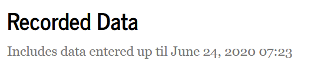{width=50%}
</center>

**How do I use the app?**

You can filter the data in the Policy Table in the app in two ways:

1.    You can use the filters for country, RA name, policy type, etc.
2.    You can click on a policy in the Timeline Visualization

**Filtering using country, RA name, etc:**

1. Select the Country and/or City/Province of the records you are trying to locate (one or more Countries can be selected simultaneously). You MUST select at least one country.

<center>

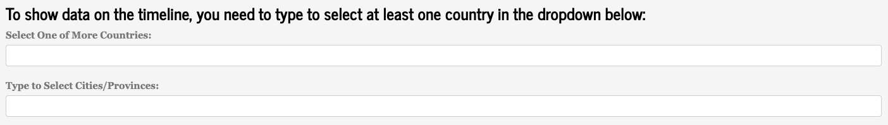{width=70%}
</center>

2. To further refine your search, the specific policy category can also be defined

<center>

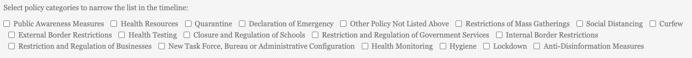{width=70%}

</center>

3. “Policy Records Table” displays a full list of all available records that match the criteria entered above
    
  * The “Correct” and “Update” buttons, shown in the table above, are a direct link to the Qualtrics survey for that individual record. The ‘record_id’ and ‘policy_id’ are also easily identifiable in this table 

<center>

.png){width=70%}


.png){width=70%}

</center>

4. “Timeline Visualization” shows the timeline in which the policies are active, and can be used to monitor ongoing policies and see if they need to be updated/ended

<center>

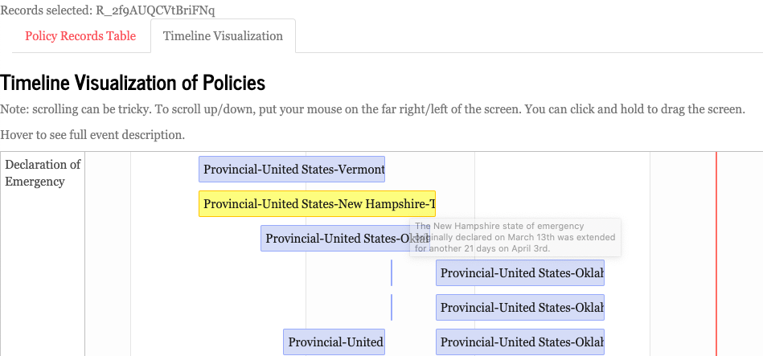{width=70%}


</center>

  *   By hovering the cursor over one of the blue tiles for a few seconds, the record description will appear
  *   By clicking on one of the blue tiles, that record will become ‘selected’. The record_id’s of the policies selected by the user will appear at the top of the page (top left of the screenshot above)
  *   If the user then clicks on the ‘Policy Records Table’ tab again, only the records selected by the user will now be visible in the list (as shown below)

<center>

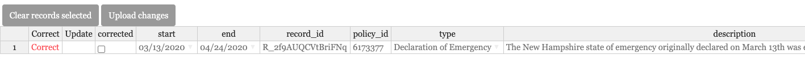{width=70%}

</center>

  *   Utilise the ‘Clear records selected’ button to clear this filter and repeat the process from the beginning 

**Correcting Entries using the Shiny App**

The Shiny App is also probably the easiest place for you to quickly correct any mistakes you have made whilst coding a policy. 

Once you have found the policy you want to correct, and it is visible in the “Policy Records Table” in the App, the sheet can be treated as a normal spreadsheet. All cells are editable by double clicking (the only cells that cannot be manually corrected are the record_id, policy_id and recorded_date).

After correcting what you require, click “upload corrections” at the top of the table, and the record will be updated!

|

IMPORTANT: THIS IS ONLY APPLICABLE FOR RECORD CORRECTIONS, NOT POLICY UPDATES! 


**Any questions regarding the App please direct towards the #record-tracker-app slack channel.**

|
|
|


## CoronaNet Learning Platform{-} 

** **

CoronaNet also has a [website](https://lumesserschmidt.github.io/stats_CoronaNet/index.html) dedicated to providing learning resources and free tutorials to anybody who wants to learn the software “R”.

The learning platform offers an introduction to “R” for new users and is paired with webinars and tutorials that utilise the CoronaNet data. So users can learn how to use/import/analyse/visualise data in “R” using the CoronaNet data as we collect it! 

Moreover, there is a [Slack channel](https://join.slack.com/share/zt-f2gjfcd2-YfqDx61ber6qGAhImKZqAQ) - #coding - that can be used for sharing R code that you find interesting and want to share, and for any coding/data related questions people have as they are learning! 

|
|
|

## Project Administration{-}

** **

### Organisational Flow Chart{-} 		
[Click here for high resolution version](https://drive.google.com/file/d/13f9kqLVbxOncZQGEyfCuUM8My6pd_0ui/view?usp=sharing) 

<center>

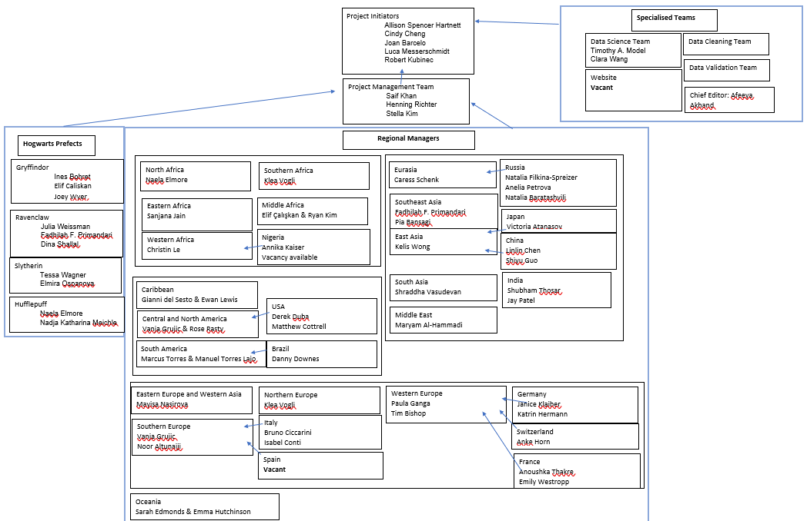
</center>


*   **All questions about how to do something in the project/where to go to help, please contact the prefects.**
*   **Any questions about your region, sources for entering your policy or if you need a break, please contact regional managers**


<center>

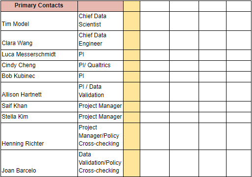
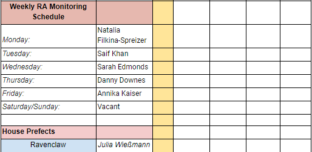
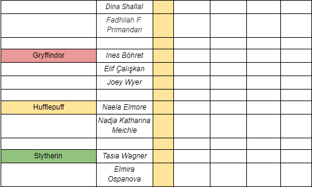
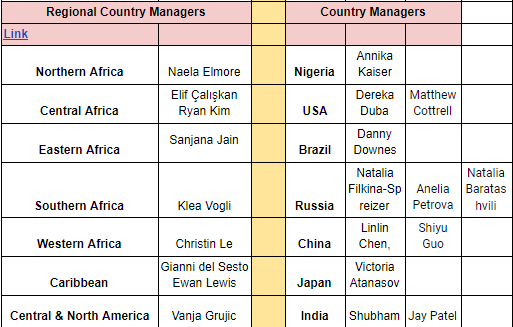
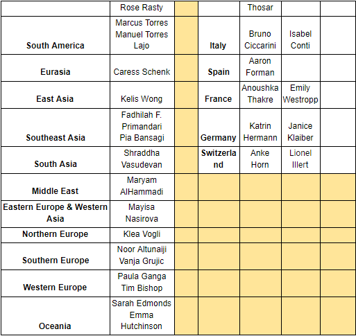
</center>


### PI Responsibilities{-}

** **

The Principal Investigators (PIs) are in charge of charting the overall course of the CoronaNet Project and for providing guidance and direction for RAs working on different parts of the project. They are also the points of contact for collaborations with other research endeavors or for handling media requests.  

In addition, the PIs also take responsibility over certain parts of the project:

**Main Qualtrics Survey**

Cindy takes primary charge of making changes to the main Qualtrics survey in consultation with the other PIs. 

**Data Cleaning and Validation**

Joan Barcelo and Allison Hartnett

Cindy also provides support for the cleaning process and makes changes to the validation survey to mirror the changes made to the Qualtrics survey


**R Shiny App**

Robert Kubinec

 

**Project Management**

Luca Messerschmidt


### Regional / Country Managers Responsibilities{-}

Regional managers oversee the countries in their region, and country managers oversee the subnational provinces/states for a particular country. In some countries, there will be more than one country manager. This is especially true for countries with large numbers of subnational provinces/states. You can find the list of countries allocated to a region and all country managers for a country in [this document](https://docs.google.com/spreadsheets/d/1gNvxWSrAdrM2aj7JyQKlAdQNdBkl7kDMOdJWSZBjvj0/edit?usp=sharing)


#### Organization{-}


*   Regional and country managers will be added to the #regional-managers Slack channel
*   Regional and country managers will be added to the regions or country Slack channel specific to the region or country that they are in charge of overseeing
*   In addition to the weekly meetings that regional and country managers should have with the RAs under their supervision (see more below in the ‘Key Responsibilities’ section), there will be periodic meetings for regional and country managers to provide feedback and exchange information with each other and the PIs. These meetings will be announced in advanced in the #regional-managers Slack channel.


#### Scope of Responsibilities{-}


*   Regional managers are responsible for fulfilling the ‘Key responsibilities’ listed below for all the countries in their region *except* for the countries for which there is already a country manager
*   Country managers are responsible for fulfilling the ‘Key responsibilities’ listed below for the national level for their country as well as the subnational provinces/states that are within their country
    *   For countries with more than one country manager, there will still be a ‘head’ country manager should it be necessary to make decisions that affect the whole country. Regardless of how many country managers a country has,  each country manager will still be solely responsible for completing the ‘Key responsibilities’ listed below for the particular provinces/states that they are overseeing.
*   Regional managers and Country managers thus have parallel roles: regional managers will be responsible  for countries under their purview (again, except for ones that have a regional manager) and country managers will be responsible for the national and subnational levels of the country under their purview. 


#### Key responsibilities{-}


1. Provide a short weekly “Progress Report” to the PIs **every Friday**. This aim of the progress report is to give a brief overview of how the region is progressing in terms of up to dateness and completeness.
    a. The progress report will be submitted via an excel sheet (regional managers should use [regional managers excel sheet](https://docs.google.com/spreadsheets/d/1gNvxWSrAdrM2aj7JyQKlAdQNdBkl7kDMOdJWSZBjvj0/edit?pli=1#gid=0); country managers should use the [country managers excel sheet](https://docs.google.com/spreadsheets/d/1J45Gme8WoxV2CaqrhiQa2wDXazQrw99wrAzF_Ew511U/edit#gid=508634612)) this noting:
        i) the ‘up-to-dateness’ of policies for a particular region or country. See part 2) for more information.
        ii) the ‘completeness’ of policies for a particular region or country. See part 3) for more information.
    b. Additionally, please contact the project management team to provide any additional information that you think is important to report. This can include:
        i) Whether there are any inactive RAs in your group
        ii) Whether there are any country reports or research notes you would like to be posted to the website
2. Check for up-to-dateness. This involves providing information about when an RA was last able to code policies for their country/region.
    a. By ‘up to date’ we mean, just knowing about when the last time it was that an RA was able to look at a particular country in a given week. It is fine if they didn’t have time, just having the information is in itself valuable
    b. Please have the RAs under your responsibility fill out the [excel sheet](https://docs.google.com/spreadsheets/d/1gNvxWSrAdrM2aj7JyQKlAdQNdBkl7kDMOdJWSZBjvj0/edit?pli=1#gid=0 ): noting when they were able to document policies for a particular country. 
        i) They should open the “ ‘Policy Up-to-Dateness” tab and use the pop-up calendars to indicate when they last updated policies for each of the policy areas.
    c. If the work is not up to date, please make sure that you know the reason why.
        i)  If the RA does not have time for a given week but is otherwise stated a commitment to the project, then note this in the excel sheet by filling in “On a break” in the “Are the RA’s Active?” column.
        ii)  If the RA is unresponsive/no longer active, these tasks may need to be reallocated. You may also nudge and message or nudge RA in your region to be more responsive
3. Check for completeness and/or accuracy of records 
    a. By ‘completeness’, we mean assessing, to the best of your ability, whether
        i)  All policy types for a particular region are coded:
            1. For example, maybe there are no policies about restrictions of mass gatherings because a) the RA didn’t code it or because b) there are simply no policies created by that government. Part of your job as a regional manager would be to communicate with the RA and figure out if the issue is a) or b). 
        ii) Each policy type is appropriately coded over time:
            2. For example, it may be the case that there are multiple policies about ‘restrictions on mass gatherings’ that overlap over time. This may be because a) the government has implemented sequential updates to one policy about restriction of mass gatherings such that the policies should not in fact, overlap in time and corrections need to be done to fix the timeline of a given policy or  b) the government has implemented multiple policies for restrictions of mass gatherings that should indeed be coded separately and there is no adjustment that needs to be made. Part of your job as regional manager would be to assess if the issue is a) or b) and communicate with the RA as necessary.  
    b. The RShiny App is primarily useful for comparing policy types and countries to pin down which policy types in which countries appear to be out of date. You can also use it to see if policies are no longer enforced (end date has passed) but may still be in force, and which policies are in force but may have expired. 
    c. Document the completeness of the records for each week in the [excel sheet](https://docs.google.com/spreadsheets/d/1gNvxWSrAdrM2aj7JyQKlAdQNdBkl7kDMOdJWSZBjvj0/edit?pli=1#gid=0) in the ‘ ‘Policy Completeness Form’. Note we expect that checking for ‘completeness’ will be a medium-term task, such that in the beginning, it might take one week to check the completeness of a just a few policies such that it might take 4-6 weeks to do an initial assessment of the completeness of the policies for the regions under the regional/country managers’ purview. After this initial assessment is done, going forward, assessing completeness should take less time/be comparable to the time it takes to check for up-to-dateness. This is a ‘joint’ task in that both RAs and regional/country managers can fill in this spreadsheet, but regional/country managers are responsible for verifying the RAs ‘completeness’ assessment. 
    d. If the work is incomplete, contains errors or requires attention, please contact the RA directly to resolve any issues. If the RA is no longer active, these tasks may need to be reallocated. Regional managers may also message or nudge an RA in their region to be more responsive.
    e. If you find repeated errors with the coding in your region, leave a note in the “RA Activity+Notes” tab.
4. Delegate tasks within their region. If a new RA is allocated to their region, they can delegate states or tasks to them as needed.
5. Check and give approval for country reports for their region.
6. Weekly meetings with their team. Each Regional and Country manager should  organize a short weekly Zoom meeting with your team (suggested length of time is half an hour but regional/country managers have flexibility to decide how long they want their meetings to be). Ideally regional and country managers would not go over the updates and completeness line by line in the meeting for each team member. Rather the meeting should be focused on discussing and resolving any issues in terms of the updateness or completeness of regions under your responsibility. 

For country managers: to to allocate and designate tasks for their subnational regions, please make use of this [sheet](https://docs.google.com/spreadsheets/d/1cesReaVkn0-w-0kGjgGHX7WHVZqtejbcQAw0SC7VRZ0/edit?usp=sharing).


####  **SOPs for Inactive RAs.**{-}


1. Check if the RA is marked inactive in the [RA Allocation Sheet](https://docs.google.com/spreadsheets/d/1qxkKu7gOdt2I0JjgJmviD6EpKdJoP9gU1p5cjOqgONk/edit?usp=sharing): If the RA is colored in orange and has number “2” marked in the inactive column, this means that the RA is no longer active with the CoronaNet Project and you should proceed to step 4.
2. If the RA is not marked inactive, message the RA on Slack. If you do not receive a response in a reasonable time, follow up with the RA via email.
3. If there is no response from email or Slack, mark “no” in the “Are All RA’s Active?” column in the “RA Activity+Notes” tab and put their name down in the “Names of Inactive RAs” column.
4. If possible, the task may need to be reallocated to other active RAs.


#### How do I become a regional/country manager?{-}

Research assistants are invited to become regional/country managers based on some combination of their expertise in the region/country, their familiarity with the CoronaNet project and their previous experience managing and coordinating people. 

There are a limited number of regional/country manager positions available and when one becomes available, we invite a research assistant to fill the vacancy. Note, while all countries have a regional manager, not all countries have country managers (that is, we do not make a systematic effort to collect subnational data for all countries) though we may expand the number of country managers on a limited basis in the future. 

If you are interested in becoming a regional or country manager, or if you would like to take on the country manager role for a country that currently is not assigned one, please contact the project management team at at [admin@coronanet-project.org](mailto:onadmin@coronanet-project.org)!


## 


### Hogwarts Houses and Prefects{-}

As part of the onboarding process each RA will be assigned to a Hogwarts house - Gryffindor, Slytherin, Hufflepuff or Ravenclaw! 

Current prefects are: 


1. Hufflepuff:
    1. Naela Elmore
    2. Nadja Katharina Meichle
2. Ravenclaw
    3. Julia Weissman
    4. Fadhilah F. Primandari
    5. Dina Shallal
3. Slytherin
    6. Tasia Wagner
    7. Konstanze Schonfeld
    8. Elmira Ospanova
4. Gryffindor
    9. Ines Bohret
    10. Kayla Schwoerer
    11. Joey Wyer

Prefects are the leaders of each of these houses. They are responsible for the social onboarding to the project and the general wellbeing of their house members. They are an additional resource for RA’s to direct their questions towards and help RA’s find answers to their questions and/or help RA’s finding the right person for them to direct their questions to. As well as this, they are generally responsible for maintaining the team spirit of their houses and ensuring RA’s have access to the resources they need.

You can see which house RAs have been allocated to on [this sheet](https://docs.google.com/spreadsheets/d/1qxkKu7gOdt2I0JjgJmviD6EpKdJoP9gU1p5cjOqgONk/edit#gid=0). 
If an RA is marked in Red in the “house assigned” column, then it means they have not been allocated into a house yet.


#### Summary of the Main Tasks{-}

  -   Evaluation of Applications


  -   Allocation of approved applicants to the houses


  -   Managing the House Slack Channels


  -   Answering their house members questions


  -   Generally ensuring the team spirit of their house is maintained
  
#### Hogwarts House Cup
**RULES**

  -   House cup will begin after the weekly meeting and will end at 15:00 CEST the following week (wed-wed), upon which points will be reset
  -   Challenges will occur in the #random channel
  -   House cup points will be allocated in the #housecup channel
 
**BASE POINTS**

**COUNTRY & REGIONAL MANAGERS**

5pts   	Up-to-dateness form
5pts   	Completeness form
3pts   	Meeting attendance
Up to 5 points are up to their discretion

**RA-CHAT**

2pts   	Given for helpfulness
RA in charge of the channel for that day + PIs to give out points, to ensure fairness

**VALIDATION TEAM**

At their discretion

**HOUSE CUP CHALLENGE**

2pts   	given per submission by prefects

  -   **MONDAY** - Ines/Kayla

  -   **TUESDAY** - Naela

  -   **WEDNESDAY** – Tasia

  -   **THURSDAY** - Julia Wießmann

  -   **FRIDAY** -  Fadhilah F. Primandari

  -   **SATURDAY** - Dina

  -   **SUNDAY** - Nadja

  -   **PIs** - PIs/Saif/Jack/Henning are able to give points to their discretion


### How do I become a Hogwarts Prefect?{-}

Becoming a Hogwarts Prefect is an exciting and rare opportunity! It is also a role of responsibility and empathy. 

So, first check #general Slack channel. All prefect vacancies are advertised there. Use the channel search function for “in:#general vacancy”. This should filter out the results.

If you see a vacancy, follow the instructions on the advert. This usually involves messaging the person that posted the advert. 

If you do not find any vacancies on #general Slack channel, then you should reach out to a member of the Project Management Team at [admin@coronanet-project.org](mailto:onadmin@coronanet-project.org). Let them know that you are interested in becoming a prefect. A member of the Project Management Team will contact you with further instructions.


### RA Responsibilities{-} 

Once the onboarding process is completed each RA is assigned a Country to work on. They will be added to the relevant Region and Country Slack channels and should introduce themselves to their fellow RA’s in the Country/Region.

They can use these channels to ask any questions they have about getting started and to communicate with the Regional/Country Manager. Other resources available are


*    **[#ra-chat](https://app.slack.com/client/T010PHG8J6A/C010V8MKHK2)** Slack channel 
*   the Hogwarts House Prefects (perhaps there is an issue with something they do not feel comfortable discussing in the Region/Country channel – this is what the Prefects are for!)
*   RA FAQ in the **Shiny App** 
*   **[CoronaNet Data Codebook](https://docs.google.com/document/d/1zvNMpwj0onFvUZ_gLl4RRjqS-clbHv3TIX6EOHofsME/edit?usp=sharing)**
*   More relevant links are found in the ‘Useful Links’ section of the Manual

 

Once an RA has been assigned a Country/State they commit to completing and updating the records for that assignment. The RA must also enter information into the Country/State specific spreadsheets that will be made available to them by the Regional/Country Manager. This information concerns the date in which they have coded policies up to and the completeness of the records – important information for the Regional/Country managers and should be updated regularly.

 

There is no requirement on the number of policies coded per day/week by each RA. Each Country is unique in their approach and we understand that finding and coding policies vary in the time it takes. It is recommended you take your time with your research before coding a policy, to ensure you code as accurately as possible. RA’s should not hesitate in asking questions in the slack channels if they are unsure. If an RA feels overwhelmed and feels they need extra support, they should contact their Region/Country Managers to let them know.

 

RA’s should also participate in the weekly meeting with their Regional Managers – which will be set up by the Regional Managers and links posted in the Slack channel.

 

In addition, RA’s should participate in/watch the recording of the general RA meeting where updates about the whole project are shared. These meetings take place on Wednesdays at 4.30pm CET at this [link](https://nyu.zoom.us/j/58230804 ). 


#### Summary of Main Tasks{-}


*   Research policies thoroughly and enter them using the Qualtrics questionnaire.
*   Keep policy records up-to-date (enter records chronologically in order to make it easier to update/end policies as they develop).
*   Continually fill out the Country specific spreadsheets - concerning how up-to-date and complete the records are for the Country/State they are covering. These sheets will be made available by the Country/Region Manger. 
*   Attend weekly RA meetings with the CoronaNet team (Wednesdays 4.30pm CEST, weekly).
*   Attend weekly meetings with the Regional/Country Managers (to be set up by the Managers and communicated in Slack).


#### RA points of contact?{-} 


*   **Regional/Country Manager**
    *   Specific questions regarding process in the Region/Country
    *   General point of contact/support
    *   Questions regarding the Country specific spreadsheets 
*   **Hogwarts Prefects **
    *   General point of contact/support
    *   Issues that may occur where the RA doesn’t feel comfortable communicating them with the Regional/Country Manager or in the public slack channels 
*   **#ra-chat **
    *   Questions regarding how policies should be coded in Qualtrics
*   **#orphaned-records**
    *   If a record cannot be located
    *   If a record needs to be deleted 
*   **#record-tracker-app**
    *   Any questions regarding the app functionality 


### RA Onboarding Process{-}

In this section, we explain how CoronaNeta’s project management team onboards RAs: 

**STEP 0: **Set up the mail account: We are using Amazon AWS which you can access [here](https://coronanet.awsapps.com/mail ).  Login/Password: Ask the project management team

Here you will find some folders in the inbox but you just need to care about the folder “RA Registration” (see screenshot). A PI or one of you should put every email from our application form in the RA-Registration Folder - Pending subfolder. All application email will have “Re: Application for Research Assistant Position” in the heading: 

<center>

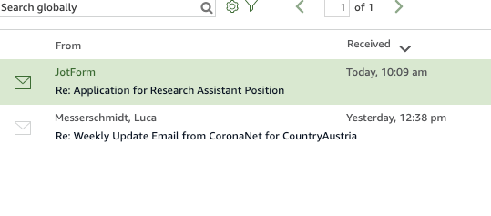{width=50%}

</center>

Once the application has been scored by at least two of you, you can put the mail in the sub-folder “Done”. 

<center>

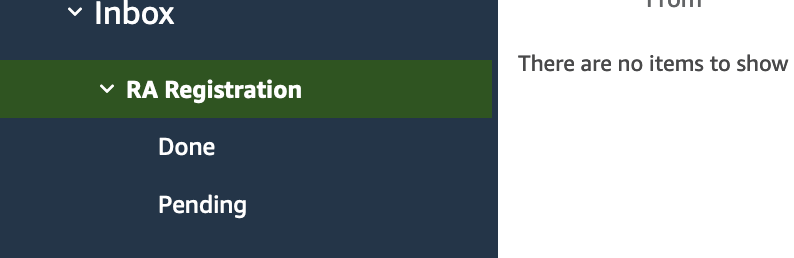{width=50%}

</center>


**<span style="text-decoration:underline;">Drawing the Registration Process</span>**

**STEP 1: **Students share their interest either via mail or click on the [form](https://form.jotform.com/201172569499062) linked to the [ra_call](https://coronanet-project.org/ra_call.html). If we get any general questions by email about how to apply, send them the following text: 

<span style="text-decoration:underline;">MAIL 1: </span>

|       Dear XYZ, 
|   
|       We appreciate your interest to join the CoronaNet Research Group. In these exceptional times it is important to gather 
|       data for real-time research. In order to apply and to become a member of the team, please fill out the following form:
|      [https://form.jotform.com/201172569499062](https://form.jotform.com/201172569499062)
|   
|       More information on the research assistant position can be found here: [https://coronanet-project.org/ra_call.html](https://coronanet-project.org/ra_call.html)
|   
|       If you have any questions, feel free to contact us! 
|
|       Kind regards, 
|
|       CoronaNet
|       
|

**STEP 2: **Once we get an application in the email inbox, you are going to screen the applications and evaluate them. Please note that the CVs/resumes will only go to the [admin@coronannet-project.org](mailto:admin@coronannet-project.org) email, so be sure to look for the applications there so you can read all the info.

With this in mind, we want at least two of you to read every application and score them on a scale of 1 to 5, with 5 being the highest score possible. We have a [google spreadsheet](https://docs.google.com/spreadsheets/d/1F2IkLcIgsw7JPzJ3sS-DcM5owF-gaoc-35T0pf6vh4U/edit#gid=0) where you can see a record of all the applications: 

On the far right-hand side are two columns, Evaluation 1 and Evaluation 2. You can record your score there once you read it (whoever gets to it first can give a score):

<center>

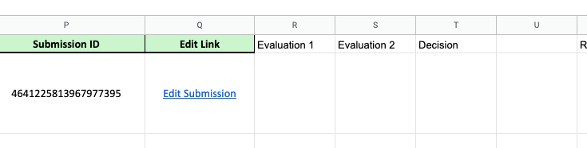{width=60%}
</center>


We will then come back and look at the application scores and make a final decision. Once we put a Y in the decision column, you can then send them the following mail: 

<span style="text-decoration:underline;">MAIL 2: </span>

|       Dear XYZ, 
|
|       We are happy to announce that you have been chosen to become part of the CoronaNet Research Group. 
|
|       You will be involved in the data collection process. The work mainly involves sifting through news reports to identify 
|       different policies that the government has enacted to combat COVID-19. You will each be assigned one unique country if 
|       you choose to participate.  If chosen, you will be responsible for (1) researching what government policies your country has 
|       implemented starting from the beginning of the epidemic and (2) keeping up to date with new government policy actions 
|       on a daily basis.
|
|       When you become experienced, you will be asked to do validation work, visualisations or write country reports.
|
|       **There are only few steps you will need to take to support this research team:**

-   Add your name to this **Google Docs list**: ([https://docs.google.com/spreadsheets/d/1cJv94NrO9Boahf441LkAqdY-xAZIlMCwnWdsrEQb8Wc/edit?usp=sharing](https://docs.google.com/spreadsheets/d/1cJv94NrO9Boahf441LkAqdY-xAZIlMCwnWdsrEQb8Wc/edit?usp=sharing))  Please indicate what applicable skills you may possess (e.g. language skills) and your country preferences (please see which countries are left in column H), which we will try to accommodate as much as possible.
-   In order to start as a Research Assistant, you are required to watch two brief  **training videos: **which will explain the project in greater depth and give you the tools you need to use our data collection software. 

    **First:** [https://nyu.zoom.us/rec/share/1_MyF6re50NLHYHqzljUQJUPNKvUT6a81nQY_PdYzU2QdKqLzG2K_QS3k8t8nFDB](https://nyu.zoom.us/rec/share/1_MyF6re50NLHYHqzljUQJUPNKvUT6a81nQY_PdYzU2QdKqLzG2K_QS3k8t8nFDB) 

    **Second:**[https://tum-conf.zoom.us/rec/play/vJF5fuGop243GdyQsQSDC_QqW426KaOshHMfqaBZnhrnViIBO1PzZ-QaZbPBtptgnr6hozgzRfrwne6q?startTime=1588513802000](https://tum-conf.zoom.us/rec/play/vJF5fuGop243GdyQsQSDC_QqW426KaOshHMfqaBZnhrnViIBO1PzZ-QaZbPBtptgnr6hozgzRfrwne6q?startTime=1588513802000) (Password: 7C&*60@=)

|
*   Through the following **survey link**, you will be asked to do an** interactive training after **you watched the videos.. [https://tummgmt.eu.qualtrics.com/jfe/form/SV_0354jWNWJ4H9tKB](https://tummgmt.eu.qualtrics.com/jfe/form/SV_0354jWNWJ4H9tKB)
*   If you have questions on how to fill out the survey, please read the [codebook](https://docs.google.com/document/d/1zvNMpwj0onFvUZ_gLl4RRjqS-clbHv3TIX6EOHofsME/edit?usp=sharing) and feel free to contact [admin@coronanet-project.org](mailto:admin@coronanet-project.org)

*   After you have passed the training, you will be allocated a country, receive the link to the main survey and will be added to Slack within 5 working days.

|       
|       

|       We hope that our project will increase the public's awareness and understanding of what policies governments around the 
|       world are taking in response to the virus. Thank you for joining this journey!
|       
|       
|       All the best, 
|       
|       
|       Robert Kubinek, Cindy Cheng, Joan Barcelo, and Luca Messerschmidt
|       
|       
|       
**If we put a N in the decision column, you can send them the following email:**

<span style="text-decoration:underline;">MAIL 3: </span>

|       Dear XYZ, 
|       
|       We appreciate your interest and application at CoronaNet. We are sorry to tell you that we have decided not 
|       to invite you to become a research assistant for our team. This does not mean that you won't be able to use the data 
|       (which you can download here:[www.coronanet-project.org](http://www.coronanet-project.org)) 
|       or tell others about it (Twitter: coronanet_org). 
|       
|       We want you to know that your attempt to help us in this project is overwhelming and you are a real hero of this crisis. 
|       
|       All the best
|       
|       CoronaNet 
|       
|       
**STEP 3:** Once people pass the test, they are directed to a [form](https://form.jotform.com/201202703393039) they will need to fill out in order to agree with the conditions of becoming a RA. Luca is going to allocate the participant to a country and connect this person with previous RAs. It can happen that people pass the test but close the tab etc.which will not allow them to enter the form. If people send you a mail with this inquiry, leave it for Luca to check the records and make a decision. 

Every time someone fills out the confirmation form, you will also see a record of it in the admin email account. Once you receive such a record, you can then add them to the Slack channel. To do so, go into slack and hit the following button on the bottom left-hand side:

<center>

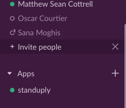
</center>


Fill out their name and email in the dialog box and hit enter. Then go back to the Application sheet and enter the **date in month-day **form into the final two columns showing that they 1) have been added to slack and 2) have passed the test/committed.

<center>

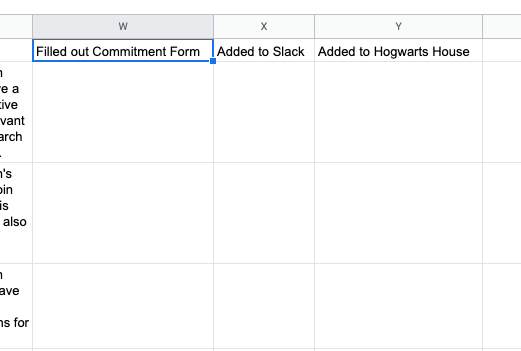{width=50%}

</center>

*   Also Add them to the **Shiny App** by inviting them via email. Will require access to the Shiny App.

**STEP 4:** Finally, when people are good to go, they need to be allocated to a Hogwarts House. Please check the [allocation sheet](https://docs.google.com/spreadsheets/d/1qxkKu7gOdt2I0JjgJmviD6EpKdJoP9gU1p5cjOqgONk/edit?usp=sharing) if there are people that have not been assigned to houses. While some people will write down their preference in the allocation form, some will just let the sorting hat decide. Please try to distribute the people equally along the houses. After you allocate a RA to a house via the allocation sheet (Column F), add them to your Slack House Channel (this can only be done by the respective prefects). When you have done so, send the applicant a welcome email to your house (be sure to offer to answer any questions they may have!), and add them to your Slack channel. Be sure to finally go back to the application Google sheet and enter the date they were added to your house.


## 


### Need a break? / Vacation{-}

We understand nobody wants to be coding whilst they are on vacation! And there is zero expectation for you to do so, this is a voluntary project and we pride ourselves on our flexibility.

 

If you have a holiday booked and/or need a break due to other commitments, please get in touch with the Country/Regional Manager for the Country you are responsible for and let them know.

 

They can arrange for another RA to cover you whilst you take a break, and ensure that the records remain up-to-date whilst you are away.
    
      

[^1]:
     Policies for which you will need to identify this information are those which can be categorized as dealing with: Quarantine, External Border Restrictions, Internal Border Restrictions, Health Monitoring, Health Testing, and Health Resources. Policies for which you will not need to identify this information are those which can be categorized as dealing with: Declaration of Emergency, Restriction of Mass Gatherings, Social Distancing, Curfew, Closure of Schools, Restriction of Non-Essential Government Services, Restriction of Non-Essential Businesses, New Task Force or Bureau. The presumption is that these categories are all targeted domestically. For more information on each of these categories, please see the type variable in the codebook. 
