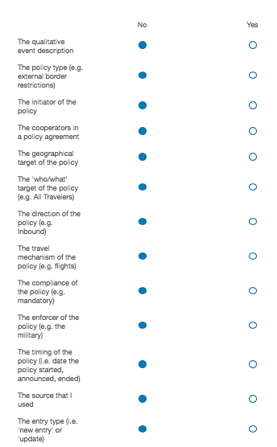
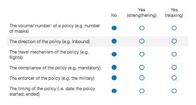
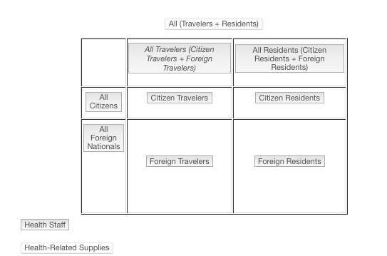

 

The following document provides all the survey questions listed in the CoronaNet Government Response Event Database. The document attempts to mimic the display logic of the survey as much as possible.  Users are advised to use the search function (CNTRL+F) and table of contents sidebar to search through the survey.

   

# Introduction

This Qualtrics form is for research assistants for the CoronaNet: COVID-19 Government Response Tracking Project. The principal investigators (PIs) for this research project are:

Please only use this form to record data once you have completed the relevant training on Zoom. Please see here for an additional video on how to update policies in the survey. The password for this video is: 7C&*60@= (the accompanying slides are pinned to the #ra-chat Slack channel).
 
While entering data:   

* Please pay attention to the description besides each element of the form.
* For each survey question, we have tried to provide descriptions of how the data should be entered or more detail about what the nature of the answer choices are when necessary.
* You can also refer to the CoronaNet Codebook for more information about the variables.
* If anything is unclear, please use the slack channel to post your question (and so that others who may have the same issue can see it) or email one of the PIs above.

  

# Record Keeping

## [ra_name]

Please select your name from the drop-down list. If you are not on the list and believe you should be, please contact one of the PIs listed above.

*   Joan Barcelo 
*  ... 
*  Patson Manda 

 

## [entry_type]

Please let us know if this is a new entry, if you would like to make a correction to an older entry, or an update on a previous restriction/policy. 
 
*  New Entry 
*  Correction to Existing Entry for record ID XXX  
*  Update on Existing Entry for record ID XXX 

 

### If [entry_type] is a Correction to Existing Entry {.tabset}

#### [entry_link_type]
Is this a correction to an original 'new entry' or a correction to an update?

*	 Correction to a new entry 
*	 Correction to an update 

#### [corr_flow]

Please identify which aspect of the policy you would like to correct.

+ Please answer No or Yes to all the possible dimensions listed below. 
+ Note for all corrections except if you just want to correct the date the source was published, you will be asked to also correct the qualtiative event description and the provide a source for your correction.
+ If you just want to correct the date the source was published, then please select no to all of the below   

I would like to correct ...  

#### [corr_entry_type]

Please select this option if (1) you had originally coded an entry as being a new entry but now realized that it was an update to an existing policy or (2) you had originally coded an entry as being an update but now relized that for the purposes of this survey, it is a new entry. Please select the entry type you would like this entry to be corrected to:

*	  New Entry 
*	  Update to Existing Entry 

#### [corr_date_pub]

I just want to correct the date the source was published. 

*  Yes 

#### [notes_correction]

Please enter a brief description of the correction you want to make for this entry. Be specific about what part of the event you would like to correct and what the correction is:  

E.g. If you accidentally chose the wrong target country, please write something like: "The original target country coded as country A was a mistake, I am correcting it to country B"

*  Text Entry [...] 

  

### If [entry_type] is an Update on Existing Entry {.tabset}

#### [update_type] 

Please select whether you want to document the end of a policy or document changes to an existing policy.
 
**End of policy** : A policy has ended if it meets one of three conditions:
 
1, The policy is cancelled or annulled
 
2. The qualitative nature of the policy type has changed.

 * E.g. The original policy closed all non-essential businesses but in the change of the policy, personal grooming stores are allowed to open while other non-essential businesses must remain closed.
 * Note, as before, changes in the quantitative nature (i.e. volume) of a policy type stillcount as a change of policy: E.g. the original policy set the restriction of mass gatherings to 100 people and the updated policy restricts it to 15 people would count as a change of policy rather than an end of policy.

3. The geographical target of the policy has changed   	

* E.g. A policy that previously had to be followed by all subnational regions now only applies to some subnational regions  

Note A: Any time (1), (2), or (3) happen, please code choose the "End of a Policy' option below. If the policy meets conditions (2) or (3), please then code the new changes as new entries:   	

* E.g. A policy that previously compelled people to stay in a government facility to quarantine but now changes to allow people to quarantine at home would meet criterion (2). The coder should then (i) document the end of the policy that compels people to stay in a government quarantine as an update to the original policy (ii) document a new policy which allows people to quarantine at home  

Note B: if a policy already has an end date announced with it, you do not additionally have to add an 'End of policy' update for the end date. However, if a policy was originally announced without an end date, and then an end is announced, then please do add an 'End of policy' update to the policy noting the end date.

 **Change of policy**: As before, any changes to any other dimensions of the policy would still count as a 'Change of a policy' rather than an 'End of a policy'.   
 
* These other dimenions are: the 'volume' of a policy,  the 'direction of the policy', the 'travel mechanism' of the policy, the 'compliance' of the policy, the 'enforcer' of the policy, and the timing of the policy 	

* E.g. A policy that compels people wear masks outside but is changed such that wearing masks is only recommended would be a 'change of policy' because the policy type has not changed, only the compliance for the policy has changed.

*  End of Policy 
*  Change of Policy 

#### [update_level]

#####   If [update_type] is 'Change of Policy' : 

Please identify which aspect of the policy you would like to update. 

* Please answer No, Yes (strenthening), or Yes (relaxing) to all the possible dimensions listed below. Note:'
* 'Yes (strenthening)' refers to either when:
  + More detail is given about a previously vague policy (e.g. originally, the policy was an external restriction on fights from countries with confirmed COVID-19 cases and in the update, the government specifies the exact countries they are banning) or;
  + A policy strengthens in terms of its conditions, coverage, or compliance, (see Codebook for examples ) or duration (e.g. a quarantine that lengthens from 14 to 28 days)
* 'Yes (relaxing)' refers to when: A policy relaxes in terms of its conditions, coverage or compliance or expected duration. E.g. schools that were previously closed are now open. 
* Note, it is possible for a policy to strengthen in some dimensions but relax on other dimensions
* Regardless of how many aspects of the policy you want to update (including none of the ones listed below) you will be directed to update the qualitative description of the policy and the date the updated policy was announced, its start date and its end date. Please also make sure to provide the source for your update.
* If something that you want to update is not an available option below,  note that updates only apply to the duration or strength of the original policy, see the CoronaNet Codebook  for more guidance/examples.
If you feel that another option should be given to account for your particular case, please contact one of the PIs on Slack.
* Note you *cannot* change the broader policy type (e.g. Declaration of Emergency, External Border Restrictions) as part of an update.  For the purposes of this survey, we do not consider it an update if a policy changes from External Border Restriction to Social Distancing for example. 
  + However if there is a change in the quantitative nature (volume/'number') of a particular policy, then please choose the option 'The volume of a policy type'  (e.g. the original policy set the restriction of mass gatherings to 100 people and the updated policy restricts it to 15 people).
 + This option applies for: the number of quarantine days, the number of people who are restricted from gathering en mass, and the number of health resources (e.g. masks, ventilators, doctors).

I would like to update ...

#### [notes_update]

Please enter a brief description of the update you want to make for this entry.  Be specific about what part of the event you would like to update and what the update  is:  
  
E.g. If the update is to extend the duration of a quarantine, please write something like: "The original quarantine was set to last until March 23, it has been extended to April 5"

*  Text Entry [...] 

    

# Policy Text Description

## [description]
Please provide a description of the government policy you are documenting in the text box below in English. This will be very important as (1) this data forms the raw basis for categorizing different parts of the policy and (2) it can help others quickly understand what the nature of the policy is about so please take your time in entering an thorough but succinct description.
 
Please include the following information in the description:   	

* The name of the country from which a policy originates 
* The date the policy is supposed to take effect 
* Information about the 'type' of policy (see buttons below) 	
* If applicable, the country or region that a policy is targeted towards 	
* If applicable, the type of people or resources a policy is targeted towards 	
* If applicable, when a policy is slated to end   

Where possible:   

* Copy and paste exact language used for each policy type variable; when necessary, make the language more succinct. 	
* However, if a particular policy applies to multiple targets, keep the original language.   

Example: India “is enforcing a two-week quarantine on all passengers, including Indian nationals arriving from or having visited China, Italy, Iran, Republic of Korea, France, Spain and Germany after Feb. 15.” --- Keep this sentence as is and don’t extract different target countries for each entry. Note that there is no information on when the policy is slated to end. For more examples of how you should enter into the description, please click on the buttons in the question below and look at the examples for each policy type.  

*  Text Entry [...] 

    

# Policy Type

## [type]

Please select the appropriate policy category. For a description and example of each policy category, please click on the relevant category below. 

  
  Declaration of Emergency   
 
  
    * Description: The head of government declares a state of national emergency 			
    * Example: On March 15, 2020, in South Africa: “President Ramaphosa announces national state of disaster” 	

  
  Quarantine    
 
  
    * Description: Targets of the policy are obliged to isolate themselves for at least 14 days because there is reason to suspect a person is infected with COVID-19. 				 			
    * Example: On March 17, “Hong Kong residents and tourists alike, who've been to Italy in the past fortnight, will be required to spend 14 days in a government quarantine centre.” 				

  
  Lockdown     
 
  
    * Description: Targets of the policy are obliged shelter in place and are only allowed to leave their shelter for specific reasons.     				 			
    * Example: In Palestine, as of March 07, "The city of Bethlehem in the occupied West Bank has been placed in lockdown after the first Palestinian cases of the new coronavirus were discovered there." 			

  
 External Border Restrictions     
 
  
    * Government policies which reduce the ability to access ports of entry or exit to or from a country.     
    * Example: On March 14, 2020, the “Namibian government suspends inbound and Outbound flights for 30 days” 	 			

  
 Internal Border Restrictions     
 
  
    * Government policies which reduce the ability to move freely within a country. 		
    * Example: In Peru as of March 15, 2020, “Officials are also restricting the movement of people across provinces.” 	 			

 

  
  Restrictions of Mass Gatherings      
 
  
    * Government policies that limit the number of people allowed to congregate in a place (including sporting events, concerts, etc.). 		
    * Example: On March 16, 2020 in the United States, “The latest recommendation announced Monday by the federal government to promote social distancing and limit the transmission of the coronavirus: no more than 10 people in one place.” 			

  
  Social Distancing     
 
  
    * These include policies which restrict the use of transport options and mask wearing polcies.	
    * Example: On March 22, the German government implemented new rules that stated that “a 1.5 meter distance should be kept at all times when in public”  					 					

  
  Curfew     
 
  
    * Government policies that limit domestic freedom of movement to certain times of the day. 	
    * Example: In Serbia, “[a]s of March 21, 2020 the following measures are in effect: Curfew for all residents with few exceptions from 8:00pm to 5:00am the next day” 				 					

  
   Closure and Regulation of Schools      
 
  
    * Government policy which regulates educational establishments in a country. This may include: closing an educational institution completely, allowing an educational institution to open with certain conditions; allowing an educational institution to stay open without conditions 	
    * Example: In Slovakia, as of March 12, “All schools and Educational establishments will be shut down” 	

  
   Restriction and Regulation of Government Services       
 
  
    * Government policy which restricts and regulates government services, both essential and essential. This can include ceasing government services completely; allowing government services to operate with conditions; or allowing overnment services to operate without conditions. 
    * Example: In Malaysia from March 18 to March 31, “All government and private services except those involved in essential services such as water, electricity, power, telecommunications, postal, transportation, fuel,finance, banking, health, pharmacy, fire, port, airport, security, retail and food supply will also be closed.”

  
   Restriction and Regulation of Businesses      
 
  
    * Government policy regulates private, commercial activity. This can include closing down commercial establishments completely; allowing commercial establishments to open with conditions; or allowing commercial establishments to open without conditions. 
    * Example: In Serbia, “As of March 21, 2020 the following measures are in effect: Supermarkets, gas stations, restaurants, post offices, banks and other service providers will be reducing their hours to observe the curfew, with some closing at 6:00 PM or earlier.”

  
   Health Monitoring      
 
  
    * Government policies that seek to monitor the health of individuals who are afflicted with or who are likely to be afflicted with the coronavirus
    * Example: On January 5, 2020, “Taiwan CDC monitors all individuals who had traveled to Wuhan within 14 days and exhibited a or symptoms of upper respiratory tract infections”

  
   Health Testing       
 
  
    * Government policies which seeks to sample large populations for coronavirus regardless of suspected likelihood of affliction with coronavirus
    * On March 22, “South Korea began testing all passengers arriving from Europe”

  
   Health Resources      
 
  
    * Government policies which affect the material (e.g. medical equipment, number of hospitals for public health) or human (e.g. doctors, nurses) health resources of a country.
    * On January 24, 2020, “Taiwan bans exports of face masks; ban extended to end of April” ; On March 20, it was announced that "to accommodate the growing demand of laboratory tests for COVID-19, His Majesty the Sultan and Yang Di-Pertuan of Brunei Darussalam has consented to the construction of an additional virology laboratory"

  
   Hygiene       
 
  
    * Government efforts to promote hygiene in public spaces (e.g. disinfection of subways, burials)
    * Spain (Madrid, region) will disinfect all vehicles involved in the scheduled passenger transport on a daily basis starting from March 11 for at least 15 days.

  
   Public Awareness Measures      
 
  
    * Efforts to disseminate or gather reliable information about COVID-19, including ways to prevent or mitigate the health effects of COVID-19.
    * Dissemination example: On March 22, it was announced that "the Provincial Youth Council in Namiba carried out an intense public awareness campaign on methods of disease prevention, during which, young associates distributed pamphlets with statements about the pandemic and ways of prevention.";
    * Gathering example: “On March 8, the Moscow Department of Transport began operating a 24-hour hotline allowing people to report on the sanitary condition of car sharing and taxi cars. In case of problems, the Department carries out an inspection and removes the car from circulation as needed.”

  
  Anti-Disinformation Measures      
 
  
    * Efforts by the government to limit the spread of false, inaccurate or harmful information with regards to COVID-19.
    * The Republic of South Africa enforces measures against any "person who 
publishes any statement, through any medium, including social media, with the 
intention to deceive" surrounding COVID-19, one's infection status and the government 
measures against COVID-19 on March 18 2020.)

  
  New Task Force, Bureau or Administrative Configuration     
 
  
    * Government policy that changes the administrative capacity of a part of government to respond to the crisis.
    * On January 20, 2020, “Taiwan activated the Central Epidemic Command Center (CECC) which mobilizes government funds and military personnel to facilitate face mask production”

  
  Other Policy Not Listed Above     
 
  
    * Government policy that is not categorizable in the above. Economic policies can be documented here.

 

### [type_sub_cat] {.tabset .tabset-fade .tabset-pills}

In the publicly released version of the dataset, the various sub types for different policy types are documented in the [type_sub_cat] variable. They are separately coded as follows:

#### Declaration of Emergency

No sub_type currently associated with Declaration of Emergency

#### Quarantine {.tabset }

##### [type_quarantine]
Please choose all that apply in terms of the conditions of the quarantine:

*   Self-Quarantine (i.e. quarantine at home) 
*   Government Quarantine (i.e. quarantine at a government hotel or facility) 
*   Quarantine outside the home or government facility (i.e. quarantine in a hotel)  
*   Quarantine only applies to people of certain ages. Please note the age restrictions in the text box. [Text Entry]  
*   Other [Text Entry] 

##### [type_quarantine_days]

If the number of days that the quarantine is in place is different from 14 days, please enter the number in the text entry below.  

Note, if this is an update to a previous entry and the quarantine has been extended, in the update, note the total number of days that the quarantine is in place. 

*   Text Entry [...] 

#### External Border Restrictions

##### [type_ext_restrict]

Please select all that apply in terms of the strategies that are employed to restrict movement on the external border.  

Note: The distinction between the 'Health Testing' variable in the type question and the 'Health screening' option given below is that the 'Health Testing' option refers to testing of the general population for the purpose of ascertaining the underlying infection rate while the 'Health Screening' option below refers to the testing of a general population for the purpose of restricting movement across borders. 	A later question will ask about what *kind* of travel the external border restrictions restrict (e.g. flights, cruises) 

*   Health Screenings (e.g. temperature checks) 
*   Health Certificates 
*   Travel History Form (e.g. documents where traveler has recently been) 
*   Visa restrictions (e.g. suspend issuance of visa) 
*   Visa extensions (e.g. visa validity extended) 
*   None of the above 
*   Other [Text Entry] 
*   Total border crossing ban 

#### Internal Border Restrictions

No sub_type currently associated with Internal Border Restrictions

#### Restrictions on Mass Gatherings {.tabset}

##### [type_mass_gathering]

If the number of people who are restricted from gathering en masse is specified, please enter the number in the text entry below:

*   Text Entry [...] 

##### [type_mass_category]  

Please select the most appropriate choice in terms of what kind of mass gathering that has been restricted, when applicable.  When applicable, please include the name of the event in the text entry.   

*   Cancellation of an annually recurring event (e.g. election, national festival)  [Text Entry] 
*   Annually recurring event allowed to occur with certain conditions (along with the name of the event, please list conditions in the text entry, separate each item with a semicolon)  [Text Entry] 
*  Postponement of an annually recurring event (e.g. election, national festival)  [Text Entry] 
*  Cancellation of a recreational or commercial event (e.g. sports game, music concert) [Text Entry]   
*  Postponement of a recreational or commercial event (e.g. sports game, music concert) [Text Entry] 
*  Attendance at religious services restricted (e.g. mosque/church closings) 
*  Prison population reduced (e.g. early release of prisoners) 
*  Events at private residencies restricted (e.g. parties held at home) 
*  Other mass gatherings not specified above restricted [Text Entry] 
*  All/Unspecified mass gatherings 

#### Social Distancing

##### [type_soc_distance]  

Please select all that apply in terms of the types of social distancing rules that are applied:  

*  Keeping a distance of at least 6 feet or 1.5 meters apart 
*  Keep a distance of some other distance not listed above. Please note the distance in meters in the text entry. [Text Entry] 

Restrictions on transportation

*  Restrictions on ridership of subways and trams 
*  Restrictions on ridership of trains 
*  Restrictions on ridership of buses 
*  Restrictions ridership of other forms of public transportation (please include details in the text entry) [Text Entry] 

Wearing masks in...

*  All public spaces / everywhere 
*  Inside public or commercial building (e.g. supermarkets) 
*  Public buildings (e.g. government buildings) [Text Entry] 
*  Private businesses (e.g. supermarkets) [Text Entry] 
*  Public transportation [Text Entry] 
*  Preschools or childcare facilities (generally for children age 5 and below) 
*  Primary Schools (generally for children ages 10 and below) 
*  Secondary Schools (generally for children ages 10 to 18) 
*  Higher education institutions (i.e. degree granting institutions) 
*   Unspecified 
*    Other [Text Entry] 

#### Curfew {.tabset}

##### [type_curfew_start]

At what time of the day does the curfew start?   

*   Time Entry   
 
 
##### [type_curfew_end]

At what time of the day does the curfew end?   

*   Time Entry   
 
#### Schools {.tabset}

##### [type_schools]
Please select all that apply in terms of which educational entities were affected by this government policy:

*   Preschool or childcare facilities (generally for children ages 5 and below)  
*  Primary Schools (generally for children ages 10 and below)   
*  Secondary Schools (generally for children ages 10 to 18)  
*  Higher education institutions (i.e. degree granting institutions)  

##### [type_school level]

Please choose one of the following in terms of how [type_school] are allowed to operate according to this policy:

*	  [type_school] allowed to open with no conditions 
*	  [type_school]  allowed to open with conditions 
*	  [type_school]  closed/locked down 

##### [type_school var]

Select all that apply in terms of the conditions under which [type_school] are allowed to operate.

In the text entry, depending on the policy   	

* Please write in the number of people that are limited from entering the school premises 	
* Please write more detail about the type of people who are not allowed to be on the school premises 	
* Please write more detail about the cleaning and sanitary procedures for classrooms 	* * Please write more detail about which hours of classroom time are produced
* Please write more detail about which hours of classroom time are produced
* Please write more detail about the special provisions or event cancelled/postponed   

*  Number of people on the school premises are limited (e.g. only 50 people allowed on school premises) [Text Entry] 
*  Types of people on school premises are limited (e.g. no parents) [Text Entry] 
*   Regular cleaning and sanitary procedures applied to [Text Entry] 
*  Physical classroom hours or meeting times reduced (e.g. classes only meet in the morning; classes meet every other day) [Text Entry] 
*  Special provisions exist for how teaching is done which applies to all teachers (e.g. All teachers must tele-teach.) [Text Entry] 
*  Special provisions exist for how teaching is done which applies to some teachers (e.g. Teachers with certain health conditions can tele-teach) [Text Entry] 
*  Special provisions for all students in a school (e.g. students in primary school do not have to social distance) [Text Entry] 
*  Special provisions exist for some students in a school  (e.g. students living with essential workers can attend school while others must stay home) [Text Entry] 
*  School event cancelled or postponed [Text Entry] 
*  Other conditions not listed above (please provide detail in the text entry) [Text Entry] 

#### Restriction and Regulation of Government Services {.tabset}

##### [type_gov_cat]
Does this policy deal with the regulation of “non-essential government services” or “essential government services”?
 
* Please follow the definition used by the government implementing the policy for determining whether this policy deals with a “non-essential” government services or an “essential” government services.  
* For example, you may personally think that keeping libraries open counts as an essential government service, but if the government policy classifies this as a non-essential government service, than please code this as a policy related to a non-essential government services. 

*  Non-Essential Government Services 
*  Essential Government Services 
*  No information in the policy about whether the government service is considered essential or non-essential 

##### [type_gov_serv]

Please select all that apply in terms of the types of non-essential government services that have been regulated

* Where applicable, please provide more detail about the service that has been regulated in the text entry. If there are multiple details, please separate each with a semicolon (e.g. marriage licenses; driving licenses) 
* To the extent possible, please try to find a source that provides more specific information about the type of government service. When this is not possible, you can choose an option that notes the type of government service is 'Unspecified'.
* If the policy states that all non-essential government services are restricted then please only choose the option 'all non-essential government services regulated' below 	* If the policy states that all essential government services are restricted then please only choose the option 'all essential government services regulated' below 	
* Note when the policy is about changing the timing of an election, please select 'restriction of mass gatherings' -- 'postponement  of an annually recurring event'; but if the policy is about changing the quality/procedure for an election, please select 'election procedures' below (e.g. mail-in voting) 

* Regulated use of governament services 
  +  Issuing of permits/certificates and/or processing of government documents [Text Entry] 
  +  Election procedures (e.g. mail-in voting) [Text Entry] 
  +  Regulations on publicly provided waste management services [Text Entry] 

* Regulated use of public outdoor spaces
  +  Beaches 
  +  Campsites 
  +  Parks 
  +  Tourist Sites 
  +  Unspecified outdoor spaces 
  +  Other public outdoor spaces [Text Entry] 

* Regulated use of public facilities 
  +  Public libraries 
  +  Public museums/galleries 
  +  Public courts  [Text Entry] 
  +  Unspecified public facilities 
  +  Other public facilities[Text Entry] 

*  Regulated hours government services available (e.g. government services office open for certain hours only)[Text Entry] 
*  Regulated government working hours (e.g. work from home policies for government workers) [Text Entry] 
*  Regulations on government meetings (including e.g. suspension of parliament)[Text Entry] 
*  Other government service not specified above [Text Entry] 
*  All non-essential government services regulated 
*  All essential government services regulated 

##### [type_gov_level]  
Please choose one of the following in terms of how activity related to [type_gov_serv] is regulated by this policy:

* This service provided by the government is provided with no conditions attached 
* This service provided by the government is provided with conditions atttached 
* This service is no longer provided by the government 

##### [type_gov_var]

 Select all that apply in terms of the conditions under which the following services are allowed to be provided: [type_gov_serv] 
 
Please include true numbers in the text entry when applicable. 

* Hygiene and sanitation measures required 
* Restriction  of number of people allowed to access as service [Text Entry] 
* Restriction of hours of service provided [Text Entry] 
*  Other conditions not specified above [Text Entry] 

#### Restriction and Regulation of Businesses {.tabset}

##### [type_business_cat]

 Please follow the definition used by the government implementing the policy for determining whether this policy deals with a “non-essential” business or an “essential business”.   
* For example, you may personally think that retail shops are an essential business, but if the government policy classifies this as a non-essential business, than please code this as a policy related to a non-essential business 

*  Non-Essential Businesses 
*  Essential Businesses 
*  No information in the policy about whether the business is considered essential or non-essential 

##### [type_business]

Please choose all that apply in terms of the types of business activity that was restricted.  

* If the type of business activity is relevant for all or unspecified non-essential businesses, please only choose 'all or unspecified non-essential businesses' below.
* If the type of business activity is relevant for all or unspecified essential businesses, please only choose 'all or unspecified essential businesses' below.
* Please note that this policy should be coded as related to businesses if they have to do with private efforts to provide the services listed below. If this is about a public service, than this policy should be coded as a restriction of non-essential government services.  

* Retail Businesses 
* Restaurants 
* Bars 
* Shopping Centers 
* Non-Essential Commercial Businesses[Text Entry] 
* Personal Grooming Businesses (e.g. hair salons) 
* Supermarkets/grocery stores 
* Private health offices (e.g. doctors offices, dentists, etc) 
* Pharmacies 
* Agriculture, forestry and fishing 
* Mining and quarrying 
* Electricity, gas, steam and air conditioning supply 
* Water supply; sewerage, waste management and remediation activities 
* Construction 
* Telecommunications 
* Information service activities 
* Publishing activities 
* Financial service activities, except insurance and pension funding 
* Insurance, reinsurance and pension funding, except compulsory social security 
* Transportation (land, water and air) 
* Warehousing and support activities for transportation 
* Other Non-Essential Businesses [Text Entry] 
* Other Essential Businesses [Text Entry] 
* All or unspecified non-essential businesses 
* All or unspecified essential businesses 

#####  [type_business_level]

Please choose one of the following in terms of how activity related to [type_business] is regulated by this policy:

*  	This type of business ([type_business]) is allowed to open with no conditions attached 
*  	This type of business  ([type_business] is allowed to open with conditions 
*  This type of business  ([type_business]) is closed/locked down 

##### [type_business_var]

Select all that apply in terms of the conditions under which ${lm://Field/1} are allowed to operate:  
   
Please include true numbers in the text entry when applicable. 

* Hygiene and sanitation measures required 
* Restriction of number of customers [Text Entry] 
*Restriction of business hours (if applicable note the hours of business in text entry) [Text Entry] 
* Restriction of working hours for employees (e.g. work at home policies) [Text Entry] 
* Maximum size of business meetings [Text Entry] 
* Maximum number of employees [Text Entry] 
* Size of store limited (e.g. stores smaller than 800 sq meters) [Text Entry] 
* Other condition not specified above (please provide detail in the text entry) 

####  Health Monitoring 

No sub_type currently associated with Health Monitoring 

####  Health Testing 

No sub_type currently associated with Health Testing

#### Health Resources

  Please choose all that apply in terms of the type of health resources that the government policy affects.   
   
For each of the following values below:   	 

* If there is additional information about the number of health resources in question, please briefly write it in the provided text box, otherwise leave the text box empty.  	  + For example, if 8 new hospitals are built, in the text entry for 'Hospitals', fill in the text entry box with '8 new hospitals'. 		 	 	 	 
* To the extent possible, please try to find a source that provides more specific information about the type of health resource. When this is not possible, you can choose an option that notes the type of medical resource is 'Unspecified'.   	 		 	
  + For example 'Unspecified Health Materials', this means that the event description describes an increase in, for example, medical equipment for a country, but does not provide more detail on what kind of medical equipment.  		 	 	   
   
* Health Materials 
  + Masks [Text Entry] 
  + Ventilators [Text Entry] 
  + Personal Protective Equipment (e.g. gowns, goggles) [Text Entry] 
  + Hand Sanitizer [Text Entry] 
  + Test Kits [Text Entry] 
  + Vaccines [Text Entry] 
  + Medicine/Drugs [Text Entry] 
  + Unspecified Health Materials 
  + Other Health Materials [Text Entry] 
* Health Infrastructure
  + Hospitals [Text Entry] 
  + Temporary Quarantine Centers [Text Entry] 
  + Temporary Medical Centers [Text Entry] 
  + Public Testing Facilities (e.g. drive-in testing for COVID-19)[Text Entry] 
  + Health Research Facilities [Text Entry] 
  + Unspecified Health Infrastructure 
  + Other Health Infrastructure [Text Entry] 
* Health Staff
  + Doctors [Text Entry] 
  + Nurses [Text Entry] 
  + Health Volunteers [Text Entry] 
  + Unspecified Health Staff 
  + Other Heath Staff [Text Entry] 
* Health Insurance [Text Entry] 

#### Hygiene

##### [type_hygiene]
Please choose all that apply in terms of the areas where hygiene and disinfection measures are being applied.  
   
If 'all' places are being disinfected, please select: Commercial areas, Public Areas and Public Transport.   
   
If more detail is provided about where a hygiene or disinfection measure is being applied, please document it in the text entry, separating out each individual item with a semicolon: e.g. If the measure is about disinfecting subway and buses, write: subways; buses. 

* Commercial areas (e.g. shopping malls,markets) [Text Entry] 
* Public areas (e.g. mosques, government buildings, schools) [Text Entry] 
* Public Transport (e.g. subways,trains) [Text Entry] 
* Burial procedures 
*  Other Areas Hygiene Measures Applied [Text Entry] 

#### Public Awareness Campaigns

##### [type_pub_awareness]  

Please select the type of public awareness measure which best applies.  
  
Note:

* Disseminating information  	 		
  + Refers to efforts to disseminate and convey reliable information about COVID-19, including ways to prevent or mitigate the health effects of COVID-19. Note that the older ‘Public Awareness Campaign’ policy type was designed to document these types of policies 		
  + E.g. “On March 22, it was announced that "the Provincial Youth Council in Namibia  carried out an intense public awareness campaign on methods of disease prevention,  during which, young associates distributed pamphlets with statements about the  pandemic and ways of prevention." 	 	 
* Gathering information 	 		
  + Refers to efforts to gather information related to COVID-19, including information that would help mitigate or suppress the health effects of COVID-19. 		
  + E.g. “On March 8, the Moscow Department of Transport began operating a 24-hour hotline allowing people to report on the sanitary condition of car sharing and taxi cars. In case of problems, the Department carries out an inspection and removes the car from circulation as needed.”
  
  
  
*	Disseminating information related to COVID-19 to the public that is reliable and factually accurate 
*	Gathering information related to COVID-19 from the public 
*	Both Disseminating and Gathering information related to COVID-19 

#### New Task Force, Bureau or Administrative Configuration {.tabset}

##### [type_new_admin]  

Please select the new administrative configuration that has been implemented in response to COVID-19.    

* When applicable, in the text entry box, please note the name of the administrative body in question.
* More information on the choices below are given here: 	 		
  + New Task Force or Bureau:  		 			
    - Government policy that changes the administrative capacity of a part of government to respond to the crisis. Note, the old broad policy type “New Task Force or Bureau’ captured the information in this, now, sub-policy type.  			
    - E.g. On January 20, 2020, “Taiwan activated the Central Epidemic Command Center (CECC) which mobilizes government funds and military personnel to facilitate face mask production” 
  + Existing government entity:  		 			
    - An existing government entity is given new or heightened powers to respond to the COVID-19 pandemic. 			
    - E.g. “Spain declares that during the state of emergency decisions are centralised to the national Health Ministry starting from March 15. The autonomous regions are obliged to notify the government on any containment measures they take regarding the Virus. Autonomous communities which have COVID-19 cases in their hospitals as well as affected private hospitals have to pass information on them to the central government.” 
  + Cooperation:
    - Governments with powers over different jurisdictions enter into agreements or treaties to cooperate on their response to the COVID-19 pandemic. 			
    - E.g. “On Apr 13, Washington Gov. Jay Inslee, California Gov. Gavin Newsom and Oregon Gov. Kate Brown announced an agreement on a shared vision for reopening their economies and controlling COVID-19 into the future”
 			 		 		 	 	    
*	New Task Force or Bureau (i.e. establishment of a temporary body) [Text Entry] 
*	Existing government entity given new powers [Text Entry] 
*	Cooperation among different jurisdictional entities (e.g. treaties or agreements among countries or provinces) [Text Entry] 
*	Other Administrative Configurations [Text Entry] 

#####  [type_new_admin_coop]  

Please select all that apply in terms of how these entities are cooperating:  

When applicable, please provide more information on what these different entities are sharing in the text entry

* Sharing information [Text Entry] 
* Sharing material resources (e.g. masks) [Text Entry] 
* Sharing human resources (e.g. doctors) [Text Entry] 
*  Coordinating timing on a policy roll out [Text Entry] 

#### Other 

##### [type_other]  

You selected 'Other Policy Not Listed Above' as the policy type. This means that you were unable to match the government policy to any of the categories listed on the previous page. After verifying this is the case, please provide a brief description of the policy here:

*   Text Entry [...] 

# Policy Initiator
 
## [country]  

From what country does this policy originate from?

* European Union 
* ...
* Zimbabwe

 

## [init_country_level]  {.tabset}

Was the policy made from a level of government other than the national level?

* No, it is at the national level 
* Yes, it is at the province/state level 
* Yes, it is at the city/municipal level 
* Yes, it is at another governmental level (e.g. county) 

### [province]

Please select the appropriate province/state for [country]  

If this policy was initiated from the city/municipal or other government level and it is difficult to identify the relevant province, leave blank. 

*  [province] 

### [city]

If this policy was announced by a particular city, please specify the city here: 

*  Text Entry [...] 

### [init_other_level]

You selected that this policy was made from a government level other than national, provincial or municipal. Please further specify one of the following

* This policy is administered by a government body a level other than national, provincial or municipal  
*  This policy is administered by a university in the absence of coordinated government action  

#### [other_uni]

With regards to university policy, normally the initiating policy actor would be the government body (e.g. national level or provincial level) with the power to administer universities. However in countries that have not coordinated government action, e.g. the United States, universities can independently make decisions about how to react to COVID-19. If this policy is about a policy initiated at a university setting in the absence of coordinated national action, please take the following two actions:  	

1. Where universities make policy decisions in the absence of coordinated government action, for the type of government policy, when necessary, please use the backtrack button and verify that you selected: 

* 'External Border Restrictions' if the university restricts travel of its academic staff to conferences. 		
* 'Internal Border Restrictions' if the university restricts movement on campus (e.g. the university switches to online classes). 
* 'Restriction of Mass Gatherings' if the university limits the number of people allowed to congregate on campus (e.g. cancels campus events, club activities).  	
* 'Social Distancing' if the university institutes a social distancing policy on campus.
* 'Curfew' if the university institutes a curfew on campus.
* 'Closure of Schools' if the university shuts down all operations. 	
* 'Restriction of Non-Essential Govt. Services' if the universtiy restricts non-essential academic services (e.g. tutoring, career counseling) . 	
* 'Restriction of Non-Essential businesses' if the university restricts recreational services (e.g. the student union, the university gym) 	
* 'Health Monitoring' if the university monitors the health of individuals who are afflicted with or who are likely afflicted with the coronavirus 
* 'Health Testing' if the university seeks to sample the university population for corona regardless of suspected likelihood of affliction with the coronavirus  	
* 'Health Resources' if the university sets up policies that seek to collect or distribute health resources to the university community (e.g. sets up a donation fund for personal protective gear, distributes one mask per student) 
* 'Public Awareness Campaign' if the university disseminates and conveys reliable information about COVID-19, including ways to prevent or mitigate the health effects of COVID-19 	
* 'New Task Force or Bureau' if the university sets up a new university body to respond to the coronavirus 	 	 

2. Please write the university name in the text entry shown below.    

*  Text Entry [...] 

 

## if [type_new_admin] is 'Cooperation among different jurisdictional entities' {.tabset}

### [init_coop]

Please select all of the countries from which this cooperation agreement was initiated from. 

* European Union 
* ...
* Zimbabwe

### [init_coop_level]

Was this cooperative agreement made at the national level or provincial level?

* At the national level 
* At the provincial/state level 

### [province_coop]

Please select the appropriate province/state for [init_coop]  
   
Note that you may select multiple provinces if needed.

* Province for [init_coop] 

   

# Geographical Target

## [target_init_same]

Does the geographic target of the policy match the initiator of the policy? 

*	Yes 
* No 

## [target_geog_level] {.tabset}

Please specify which geographical or administrative entity is the target of the policy:

*	All countries 
*	One or more regional groupings 
*	One or more countries, but not all countries 
*	One or more countries and one or more regional groupings 
*	A geographical or administrative unit within a country 
*	An international organization (e.g. World Health Organization)

### [target_country]

Please select as many countries that are targets of this policy as applicable.   

Note, if the target countries is all countries except for one, for example, you can use the 'select all' button to select all of the countries, and then click on the country that is the exception to 'de-select' it. Note if the policy applies to all countries with no exceptions, then please choose the 'All countries' option in response to the previous request to 'Please specify which geographical or administrative entity is the target of the policy.'

* European Union 
* ...
* Zimbabwe

### [target_region]

Please choose as many applicable regions as possible.  
   
If the targets are regions with the exception of a single country (e.g. all Schengen Countries except Switzerland) then please choose 'Other Regions' and enter this into the text field.

* European  
* ...
* Other Regions (please specify below) [Text Entry] 

### [target_country_sub]

Please specify the country for which the targeted subnational geographical or administrative unit is located:

* Afghanistan 
* ...
* Other (please specify below) [Text Entry] 

## if [target_geog_level] is 'A geographical or administrative unit within a country'  {.tabset}

 

### [target_geog_sublevel] {.tabset}

What subnational geographical or administrative unit is this policy targeted towards?

* One or more provinces within a country 
* One or more cities within a country 
* One or more other geographical or administrative unit within a country (e.g. county) 

#### target_province

Please select the appropriate province/state for [target_country_sub]

To select multiple provinces, please press CMD or CTRL and then click 	If this policy was initiated from the city/municipal or other government level and it is difficult to identify the relevant province, leave blank.   

*  [target_province] 

#### target_city

Please write in what cities/municipalities this policy is targeted towards:  
   
If there are multiple cities/municipalities, please separate with a semicolon and include the corresponding province name in parentheses (e.g. Beijing (Beijing);  Los Angeles (California); Munich (Bavaria)).

*  Text Entry [...] 

#### target_other

Please write in what other geographic or administrative unit this policy is targeted towards:  
  
If there are multiple geographic or administrative units, please separate with a semicolon and include the corresponding province name in parentheses (e.g. Santa Clara County (California); Sonoma County (California)).

*  Text Entry [...] 

#### target_intl_org

Please write in what international organization this policy is targeted towards.  

Please spell out the full name of the international organization. If there are multiple international organizations, please separate with a semicolon (e.g. World Health Organization; United Nations)

*  Text Entry [...] 

   

# Demographic Target

## [target_who_what]
 Please select from the list below what or whom the policy is targeted at (could be another country, residents inside the country, etc.). For a description and example of each category, please click on the relevant button below. For a visualization of how these variables relate to each other, please refer to the table below:
 

  
   All (Travelers + Residents)        
 
  
    * A government policy that applies to all humans regardless of residency or travel status. 
    * Example: “Starting March 16, Germany will close its borders with Austria, Denmark, France, Luxembourg and Switzerland, the country’s interior minister said on March 15.” 	

  
   All Travelers (Citizen Travelers + Foreign Travelers)  			 		      
 
  
    * A government policy that applies to all those travelling outside the country initiating the policy, both foreign and domestic. 	
    * Example: In South Africa, on March 15 “all travelers who have entered South Africa from high risk countries since mid February will be required to present themselves for testing” 	

  
   Citizen Travelers  
 
  
    * A government policy that applies only to domestic nationals travelling outside the country initiating the policy. 	 	
    * Example: As of March 15, according to the Ghanaian government, “Ghanaian citizens must self-quarantine for 14 days upon re-entry.” 

  
   All Travelers (Citizen Travelers + Foreign Travelers)  			 		      
 
  
    * A government policy that applies to all those travelling outside the country initiating the policy, both foreign and domestic. 	
    * Example: In South Africa, on March 15 “all travelers who have entered South Africa from high risk countries since mid February will be required to present themselves for testing” 	

  
   Foreign Travelers  
 
  
    * A government policy that applies to only to foreign nationals travelling outside the country initiating the policy.
    * Example: “As of March 16, all travelers without permanent or temporary residency for more than 90 days cannot enter the country, according to the U.S. Embassy in the Czech Republic.”  

 
 

  
   All Residents (Citizen Residents + Foreign Residents)    
 
  
    * Government policy targeted toward residents, both foreign nationals and domestic nationals, in the country initiating the policy. 	
    * Example: In the Dominican Republic, starting March 20, there is a “Nationwide nighttime curfew over the next two weeks.”  

 

  
   Citizen Residents  
 
  
    * Government policies that apply only to citizens who are residing in the country initiating the policy. 		
    * Example: On March 21, "the Hungarian government has asked its citizens to avoid any travel to infected areas, according to the U.S. Embassy in Hungary." 					 	

  
   Foreign Residents (Foreign Nationals Residing in the Country)  
 
  
    * Government policies that that apply only to foreign nationals who are residing in the country in initiating the policy 		
    * Example: "The United Arab Emirates is barring entry to holders of valid resident visas for a renewable period of two weeks, effective Thursday March 19."  					 	

 

  
   All Citizens (Citizen Residents + Citizen Travelers)   
 
  
    * Individuals with citizenship or permanent residency in the country initiating the policy  					 	

  
   All Foreign Nationals (Foreign Residents + Foreign Travelers)   
 
  
    * Individuals without citizenship or permanent residency in the country initiating the policy. 					 	

 

  
   Health Staff   
 
  
    * Government policy targeted toward human health resources.  
    * On February 23, “Taiwan bans healthcare workers from travelling abroad.” 			

 

  
  Health-Related Supplies 
 
  
    * Government policy targeted toward non-human health resources. 					 				
    * On March 4, “Taiwan bans export of digital thermometers.” 					 		

* Other [Text Entry] 

 

## [target_who_gen]

If a policy targeted toward a particular part of a population (under a criteria other than ‘citizenship’ status or ‘residency’ status, which is captured by the ‘target_who_what’ question), please select all that apply in the choices given below. 

* If the policy is targeted toward the general population or the policy does not specify a particular target, then please choose ‘No special population targeted’ 
* Note that with regards to the distinction below provided between 'essential' and 'non-essential' workers, please follow whatever guidance the policy actually gives instead of making your own inference. For instance, it is conceivable that a government might deem a 'doctor' a 'non-essential' worker or that a government refers to 'doctors' without noting that they are essential workers.  

* Asylum/refugee seekers 
* Homeless population 
* Domestically abused people 
* Domestic abusers 
* Prisoners 
* People in nursing homes/long term care facilities 
* People of a certain age (please note age range in the text entry) [Text Entry] 
* People with certain health conditions (please note which health conditions in the text entry) [Text Entry] 
* Essential workers (please note their occuption in the text entry where applicable) [Text Entry] 
* Non-essential workers (please note their occupation in the text entry where applicable) [Text Entry] 
* Migrant workers (please note their occupation in the text entry where applicable) [Text Entry] 
* Other workers where the distinction between essential or non-essential is not explictely made (please note the occupation in the text entry) [Text Entry] 
* Other population not specifed above [Text Entry] 
* No special population targeted 

   

# Target Direction

## [target_direction]

Please select whether this policy is inbound, outbound or both inbound/outbound. For a description and example of each category, please click on the below.

  
   Inbound     
 
  
    * Government policy that seeks to control movement of people or goods entering the country initiating the policy
    * Example: In Malaysia, on January 30, “The state of Sabah has canceled all flights from China and South Korea.” 

  
   Outbound    
 
  
    * Government policy that seeks to control movement of people or goods exiting the country initiating the policy. 
    * Example: On March 18, “The government of Belgium declared all nonessential travel outside of Belgium is forbidden until April 5, according to the United States Embassy in Belgium.” 	

  
   Inbound/Outbound    
 
  
    * Government policy that seeks to control the movement of people or goods entering or exiting the country    
    * Example: In Jordan, “As of March 17, all flights, excluding commercial airfreight traffic, will be suspended, according to officials.” 

*   Not Applicable 

 

## [target_dir_health_imp]

You have selected the 'Health Resources' policy type and that the target direction of the policy is inbound. If applicable, please further specify whether the policy deals with:

*	 Increasing Imports [Text Entry]  
*	 Restricting Imports [Text Entry]  
*   Not Applicable 

 

## [target_dir_health_exp]

You have selected the 'Health Resources' policy type and the target direction of the policy is 'outbound'. If applicable please further specify whether the policy deals with:

*	 o	Increasing exports (e.g. donating masks to another country) 
  
*	 o	Restricting exports (e.g. preventing the export of hand sanitizer) 
  
*   Not Applicable 

   

# Travel Mechanism

## [travel_mechanism]

*  All kinds of transport 
*  Flights 
*  Land Border 
*  Trains 
*  Buses 
*  Seaports 
*  Cruises 
*  Ferries 
*  Other (please specify) [Text Entry] 
*  Not Applicable 

  

# Compliance

## [compliance}

  
   Mandatory With Legal Penalties     
 
  
    * The prescribed government policy is mandatory/ must be followed. If the description of a policy does not state otherwise, assume that it is mandatory. If the policy is not followed, people may face legal penalties like jail time.   
    * Example: “On March 15, Uruguay announced it would halt all flights from Europe starting March 20. 	

  
   Mandatory With Legal Penalties     
 
  
    * The prescribed government policy is mandatory/ must be followed. If the description of a policy does not state otherwise, assume that it is mandatory. If the policy is not followed, people may face legal penalties like jail time.   
    * Example: In Switzerland as announced on March 22, "Gatherings in public spaces of more than 5 people are prohibited. This includes public spaces such as public squares, park, playgrounds, walking paths, etc. If five or fewer people meet, they must maintain a distance of 2 meters from one another. Anyone not complying with this rule will be fined." 					 			

  
   Mandatory (Unspecified/Implied)     
 
  
    * The prescribed government policy is mandatory/must be followed but the penalty for failing to comply is not made explicit or is implied. For instance, in the example given below, the implication of the policy (even though it is not explicitly stated) is that travelers without a health certificate will not be allowed to enter the country.    
    * Example: In the Dominican Republic, as of March 19, “all travelers arriving in the country must complete a travel history form”  	 			

  
   Mandatory (Unspecified/Implied)     
 
  
    * There are some exceptions to the policy but it is mandatory for those for whom it applies.  	    
    * Example: E.g. As of March 13, the Indian government suspended most travel and tourism visas, with the exception of “diplomatic, official, U.N. or International Organizations, employment and project visas” until April 15.  		

  
   Recommended/Voluntary but no penalties     
 
  
    * The prescribed policy is recommended by the initiating body but compliance is voluntary 	.  	    
    * Example: As of March 14, Brazil had not imposed travel restrictions. Its health ministry recommended that all passengers who arrive on international flights remain at home for at least seven days and seek medical help if they develop coronavirus symptoms.   		

  

# Enforcer

## {enforcer} 

Please select all that apply in terms of organizations enforcing compliance or issuing recommendations for the policy you are documenting.  

Note that the response 'police' can refer to police at any level of government (e.g. national, provincial, etc.) Please select as many dimensions as possible. That is, if the source says a policy is enforced by the provincial police, please select both 'provincial/state government' and 'police'. If the report only refers to police enforcement without stating the level of government, then select 'police only.  

*  National Government 
*  Ministry/Department of Health 
*  Ministry/Department of Foreign Affairs 
*  Ministry/Department of Justice 
*  Ministry/Department of Education 
*  Military 
*  Provincial/State Government 
*  Municipal Government 
*  Police 
*  New (COVID-19 specific) Task Force 
*   Other (Please specify in the text box) [Text Entry] 

  

# Dates

## [date_announced]

When was this policy announced?

*  Date Entry 

 

## [date_start]

When does the policy take effect? If there is no available information about this, just use the day it was announced.   	
 
Note if you are coding an update, please use the start date announced by the updated policy if applicable.

*  Date Entry 

 

## [date_end]

When does the policy end? If there is no available information about this, just leave blank.   	

Note if you are coding an update, please use the end date announced by the updated policy if applicable.  

*  Date Entry 

  

# Sources

## [link]

Please record the sources of information that you used to collect this data in the below.  

 Please remember to save a .pdf of the source that you collected. Save the .pdf with the following filename format "[Date Source Collected]_[Title of the Source].pdf": [Date Source Collected]  refers to the day on which the RA collects the data, not when the source was published Note the [Date Source Collected] should be in the following format: MM-DD-YYYY (e.g. 03-22-2020). E.g. "03-21-2020_CDC implements extra inspection measures for Wuhan flights.pdf"  If using a frequently updated version of a website as your source (e.g. the US Embassy website for you country) please be sure to save a new .pdf each day that you access it  

NOTE: In the text entry for 'Date Published' Please enter the date that the source was published, NOT the date the source was collected. In short, please enter the date the source was published in the text entry box, but to save the date the source was collected in the .pdf.

  

# Notes

## [notes}

 If you have any other thoughts/concerns/things we should know about this event, please input them here and we will review them.
 
 *  Text Entry [...] 
