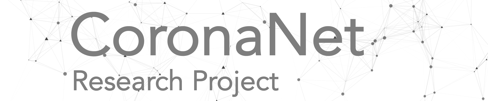

```{r setup, include=FALSE}
knitr::opts_chunk$set(echo = TRUE)

```

<!-- ```{js logo-js, echo=FALSE} -->

<!-- $(document).ready(function() { -->
<!--   $('#header').parent().prepend('<div id=\"logo\"></div>'); -->
<!--   $('#header').css('margin-right', '270px') -->
<!-- }); -->
<!-- ``` -->


\renewcommand{\topfraction}{.85}
\renewcommand{\bottomfraction}{.7}
\renewcommand{\textfraction}{.15}
\renewcommand{\floatpagefraction}{.66}




<style>
body {
text-align: justify}
</style>

***
# Tracking government responses towards COVID-19 {-}
#### by Joan Barceló, Cindy Cheng, Allison Hartnett, Robert Kubinec, Luca Messerschmidt {-}
***

The **CoronaNet Research Project** compiles a database on government responses to the corona virus. Our main focus is to collect as much information as we can about the various fine-grained actions governments are taking to defeat the coronavirus. This includes not only gathering information about which governments are responding to the coronavirus, but who they are targeting the policies toward (e.g. other countries), how they are doing it (e.g. travel restrictions, banning exports of masks) and when they are doing it.

Together with 200 political, social and public health science scholars from all over the world, we present an initial release of a large hand-coded dataset of more than 5,000 separate policy announcements from governments around the world visible since January 1st 2020.

The data yields detailed information on 

* The level of government responding to the corona virus crisis (e.g. national, regional/state, local/municipal) 

* Specific actions taken (e.g. travel bans, investments in the public health sector, etc.)

* Geographical areas targeted by these measures 

* Who or what they are targeting (e.g. foreigners, ventilators)

* Compliance mechanisms (e.g. mandatory or voluntary) 

* Timing of policy responses.

<br><br>

##  Data Download {-}

Please note that - given the exceptional times - we decided to release a ***BETA version*** of the dataset that has not undergone extensive validation and reliability checks. We aim to validate and improve the data day by day but can not assure full accuracy among the policies. 

You can **download the BETA dataset** and codebook [here](https://coronanet-project.org/download).

For further information on the methodology and analyses please download our **working paper** [here](https://coronanet-project.org/working_papers).

***

##  Citation {-}

Please cite the project and dataset as:

Cheng, Cindy, Joan Barcelo, Allison Spencer Hartnett, Robert Kubinec, and Luca Messerschmidt. 2020. “CoronaNet - Tracking Governments COVID-19 Responses”, BETAVersion 1.0. https://www.coronanet-project.org.


***
##  Questions, feedback or joining the team? {-}

CoronaNet is an ongoing research project and we aim to publish new data versions on a daily basis. The project is supervised by senior political scientists from NYU Abu Dhabi, TU Munich and Yale University, and underlies high-standard validity and reliability checks.
If you have any questions regarding the data, you find any inaccuracies, or you want to become part of our network, please contact us [here](https://forms.gle/2Zc5Rrdq9J43b7NR9).


***
# CoronaNet Research Group {-}


The project is organized and led by:

+ [Joan Barcelo](https://sites.google.com/view/joanbarcelo/home?authuser=1) (NYU Abu Dhabi)

+ [Cindy Cheng](http://cindyyawencheng.com/) (Hochschule für Politik at the TU Munich)

+ [Allison Hartnett](http://www.allisonhartnett.io/) (Yale University)

+ [Robert Kubinec](http://www.robertkubinec.com/#about) (NYU Abu Dhabi)

+ [Luca Messerschmidt ](https://lumesserschmidt.github.io/aboutme/) (Hochschule für Politik at the TU Munich)


***

CoronaNet International Data Gathering Initiative on COVID-19 Testing is organized by

+ Petr Bartoň (Charles University)

+ Josef Montag (Charles University)

+ Sana Mughees (Shifa College of Medicine)


We are thankful for the amazing network of 200 scholars from social, political, public health, and medical sciences, coming from all continents and speaking more than 30 different languages.

```{r echo= FALSE, results='asis'}
library(knitr)
library(readxl)
contribution <- readRDS("data/people/contribution.rds")
contribution <- dplyr::rename(contribution, Country = country)
DT::datatable(contribution,
          caption = 'Table of contributing researchers and their responsible countries',
          class = 'cell-border stripe', 
          filter = 'top',
          escape= c(1,2,4,3),
          fillContainer = FALSE, 
          options = list(pageLength = 250, 
                         autoWidth = TRUE,
                         dom = 'Bfrtip',
                         scrollX = TRUE, 
            selection="multiple"
          ))
```


***
### Partner Universities {-}


***
### Partner Institutions {-}
<div style="width:100px; height:75px">
[](https://www.jataware.com/)
</div>

