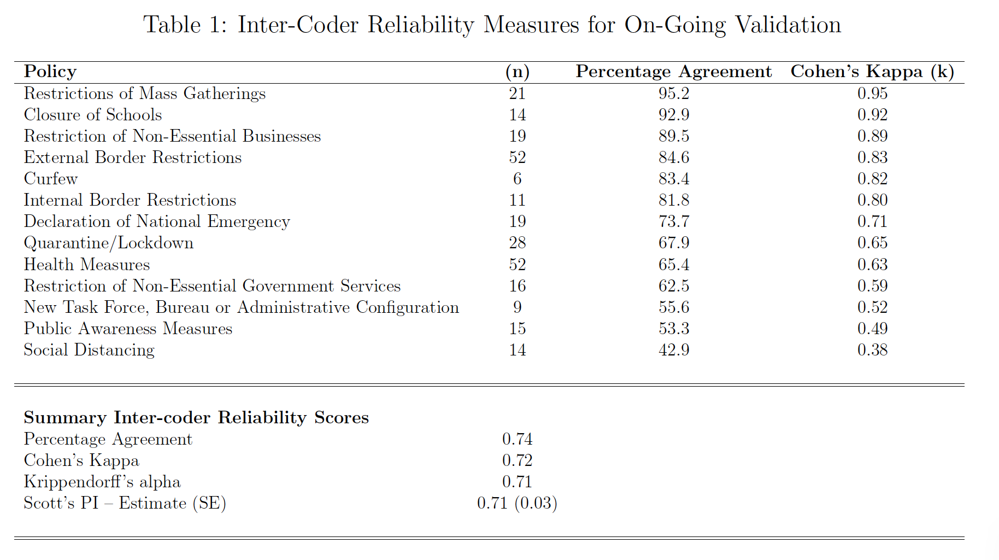

```{r setup, include=FALSE}
knitr::opts_chunk$set(echo = TRUE)
```

CoronaNet implements the following processes to validate the quality of the dataset:

### Cleaning {-}

Before validation, we use a team of RAs to check the raw data for logical inconsistencies and typographical errors. In our latest data release, we have cleaned all observations until April 1st.

### Multiple Coding for Validation {-}

We randomly sample 10% of the dataset using the source of the data (e.g. newspaper article, government press release) as our unit of randomization. We use the source as our unit of randomization because one source may detail many different policy types. We then provide this source to a fully independent RA and ask her to code for the government policy contained in the sampled source in a separate, but identical, survey instrument. If the source is in a language the RA cannot read, then a new source is drawn. The RA then codes all policies in the given source. This practice is repeated a third time by a third independent coder. Given the fact that each source in the sample is coded three times, we can assess the reliability of our measures and report the reliability score of each coder.

We are currently in the process of completing our second coding of the validation sample. 297 policies have been double coded---276 double-coded policies after excluding the category 'Other policies' from the analysis---out of the original 500 randomly-selected policies included in our validation set. This is equivalent to 10\% of the first 5,000 policies in the dataset. We will be gradually expanding the validation set until we cover 10\% of all observations. 

The following table reports the inter-coder reliability at the current stage of validation:


```{r, echo=FALSE, out.width="100%"}

```

In the following weeks, we expect inter-coder reliability scores to improve as a consequence of three processes: (a) our coders are becoming more experience with the codebook and the coding tasks in general; (b) we are cleaning the dataset of obvious errors and logical inconsistencies; and, (c) we are working on clarifying and improving the codebook and the coding system. Notwithstanding these processes, we acknowledge that some ambiguities will unavoidably remain providing evidence for the utility of our planned "majority voting" validation strategy.

### Evaluation and Reconciliation {-}

We check for discrepancies between the originally coded data and the second and third coding of the data through two primary methods. First, we use majority-voting to establish a consensus for policy labels. In addition, we will provide RA identification codes that will allow users to evaluate coder accuracy.

If the majority achieves consensus, then we consider the entry valid. If a discrepancy exists, a fourth RA or PI makes an assessment of the three entries to determine whether one, some, a combination of all three is most accurate. Reconciled policies are then entered into the dataset as a correction for full transparency. If an RA was found to have made a coding mistake, then we sample six of their previous entries: 3 entries which correspond to the type of mistake made (e.g. if the RA incorrectly codes an 'External Border Restriction' as a 'Quarantine', we sample 3 entries where the RA has coded a policy as being about a 'Quarantine') and randomly sample 3 more entries to ascertain whether the mistake was systematic or not. If systematic errors are found, entries coded by that individual will be entirely recoded by a new RA.
