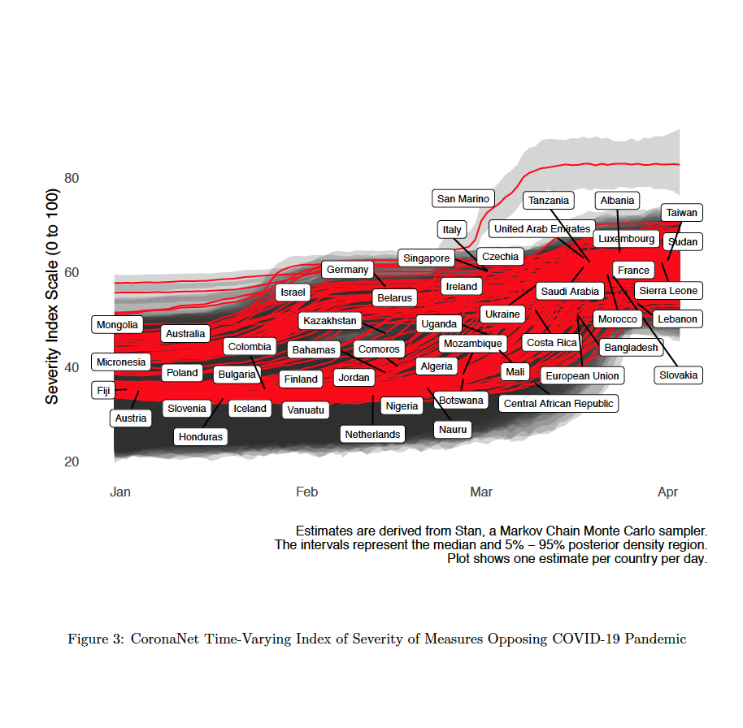

```{r setup, include=FALSE}
knitr::opts_chunk$set(echo = TRUE,warning = FALSE,echo=FALSE)
require(dygraphs)
require(dplyr)
require(lubridate)
require(tidyr)
require(stringr)
library(zoo)
library(highcharter)
library(xts)
```
<style>
body {
text-align: justify}
</style>
***
## Distribution Plot: Cumulative number of policies by type  {-}


## Time Trend: Policy Activity Index {-}



## Time Trend: Policy Activity Index (specific countries)  {-}


Given the enormous size of our data, we constructed a policy activity index that summarizes the different indicators in our data for each country for each day since Jan. 1st 2020. The index is produced using a statistical mdoel that takes into account which policies seem to be more costly/difficult to implement than other policies. For more details on the methodology, see our [working paper](https://osf.io/preprints/socarxiv/dkvxy/). The estimation is done with Stan and is updated daily. 

In the plot below you can see scores for the vast majority of countries in the world. If hover over a line in the plot, you can see the country's policy activity score for that day.

```{r policyindex}

get_est <- readRDS("data/get_est.rds")
 
 
get_est_sum <- get_est %>%
            ungroup %>%
            mutate(estimate=(estimate-min(estimate))/(max(estimate)-min(estimate))*100,
                   date_announced=ymd(as.character(date_announced))) %>%
  group_by(country,date_announced) %>%
  summarize(med_est=median(estimate),
            high_est=quantile(estimate,.95),
            low_est=quantile(estimate,.05)) %>%
  group_by(date_announced) %>%
  mutate(`Country Rank`=rank(med_est))
 

list_countries <- c("United States of America",
                   # "United Kingdom",
                    "China",
                    "Taiwan",
                    "Germany",
                    "Singapore",
                    "Italy",
                    "France",
                    "South Korea",
                    "Gabon",
                   # "Croatia",
                    "United Arab Emirates",
                    "Yemen")

random_country <- group_by(get_est_sum,country) %>% 
  sample_n(1)


# get_est_sum %>%
#   group_by(country) %>% 
#   plot_ly(x=~date_announced,y=~med_est) %>% 
#   add_lines %>% 
#   layout(title = 'CoronaNet Index of National Policy Activity of Measures Opposing COVID-19 Pandemic',
#          xaxis = list(title = 'Policy Activity Index Scale (0 to 100)'),
#          yaxis = list (title = ''))

check <- select(get_est_sum,country,date_announced,med_est) %>% 
  arrange(country,date_announced) %>% 
  spread(key="country",value="med_est") 
check_xts <- xts(as.matrix(select(ungroup(check),-date_announced)),check$date_announced)

dygraph(check_xts,main="CoronaNet Index of National Policy Activity of Measures Opposing COVID-19 Pandemic") %>% 
  dyHighlight(highlightCircleSize = 0, 
              highlightSeriesBackgroundAlpha = 0.3,
              hideOnMouseOut = FALSE,
              highlightSeriesOpts = list(strokeWidth = 3)) %>% 
  dyLegend(labelsSeparateLines = F) %>% 
  dyCSS("data/dy.css")

```


